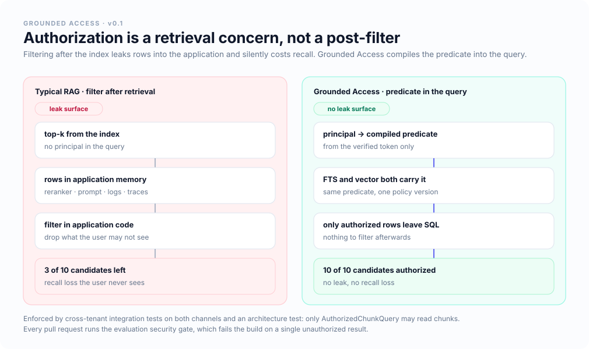
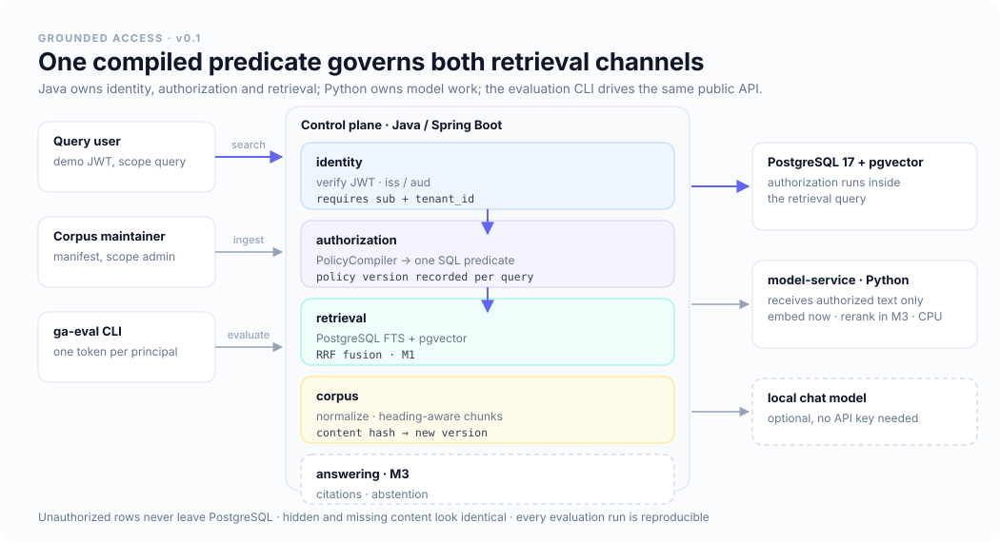

<p align="center">
    
</p>

<h1 align="center">Grounded Access</h1>

<p align="center">
    <b>Permission-aware, evaluation-driven retrieval for enterprise knowledge.</b><br/>Authorization is compiled into the retrieval query, and every retrieval change has to prove itself against a public evaluation.
</p>

<p align="center">
    <a href="https://github.com/poppycoderr/grounded-access/actions/workflows/build.yml"></a>
    <a href="./LICENSE"></a>
    
    
    
    
    
</p>

<p align="center">
    <b>English</b> · <a href="./README.zh-CN.md">简体中文</a> · <a href="./docs/architecture/overview.md">Architecture</a> · <a href="./docs/evaluation/strategy.md">Evaluation</a> · <a href="./docs/project/milestones.md">Milestones</a>
</p>

---

## Highlights

- 🔐 **Authorization inside the query**: the principal is compiled into one SQL predicate that both the keyword and the vector channel carry, so unauthorized rows never reach the ranker, the prompt, the logs or the traces
- 🙈 **No existence leaks**: content you may not see is indistinguishable from content that does not exist — the same 404, the same empty answer, no "3 results filtered" counter
- 📊 **Measured, not asserted**: a versioned corpus with human-checked labels, span-based relevance and a report anyone can regenerate from committed result files
- 🚦 **A security gate on every pull request**: one unauthorized result fails the build
- 🧪 **Honest baselines**: the keyword channel is called PostgreSQL FTS, not BM25, and vector search is exact in v0.1 so filtering cannot quietly cost recall
- 🔑 **Runs without an API key**: PostgreSQL, a CPU embedding service with weights baked into the image, and a demo corpus — `docker compose up` and nothing else
- 🧩 **A real polyglot boundary**: Java owns identity, authorization, ingestion and retrieval; Python owns model work behind a versioned OpenAPI contract and never touches the database
- 🤖 **Agent-ready**: `AGENTS.md` and `CLAUDE.md` carry the rules that must not be broken, and architecture tests fail the build when they are

> **Status:** M0 (walking skeleton) is complete and running in CI. Hybrid retrieval, the full ABAC decision table, reranking, grounded answers and tracing are the next milestones. Everything below is implemented unless it says otherwise.

## Why it exists

Most RAG demos retrieve first and filter afterwards. That leaks rows into application memory — and from there into rerankers, prompts and logs — while silently costing recall, because the filter eats the top-k that the index already chose.

<p align="center">
    
</p>

## Quick start

Requirements: Docker, [uv](https://docs.astral.sh/uv/), and about 5 minutes for the first image build. No API key, no GPU.

```bash
git clone https://github.com/poppycoderr/grounded-access.git
cd grounded-access

docker compose up -d --build --wait   # PostgreSQL + pgvector, control plane, CPU model service
./scripts/load-demo                   # ingest the fictional Northstar and Orbit Labs corpora
./scripts/demo-queries                # same question, different identities
./scripts/benchmark                   # evaluate every strategy and enforce the security gate
```

Search as any demo identity, or mint a token and call the API yourself:

```bash
uv run --project packages/evaluation ga-eval search alice-engineer "How many paid volunteer days do EU employees receive?"

TOKEN=$(uv run scripts/mint-token.py alice-engineer --scope "query debug")
curl -s localhost:8080/api/v1/retrieval/search -H "Authorization: Bearer $TOKEN" \
  -H 'content-type: application/json' \
  -d '{"query":"paid volunteer days","strategy":"dense-only","k":3}'
```

## See it work

The same question, asked by two identities in different tenants. Nothing about the request changes except the token:

```text
alice-engineer (tenant northstar) · dense-only · policy tenant-only/1
  1. hr-volunteer-policy › Volunteer Time Off Policy > European Union
     Employees based in the EU receive two paid volunteer days per calendar year.
  2. hr-volunteer-policy › Volunteer Time Off Policy > United States
     Employees based in the US receive one paid volunteer day per calendar year.

mallory-outsider (tenant external) · dense-only · policy tenant-only/1
  1. volunteer-handbook › Community Volunteering Handbook > Volunteer days
     Orbit Labs employees receive three volunteer days per year, which can be taken as half days.
```

The outsider does not get a "permission denied", a hit count or a document title. The Northstar policy simply is not part of their world.

## Retrieval evaluation

From the CI run of the walking-skeleton dataset: 15 cases, 10 documents, 2 tenants.

| Strategy | Answerable cases | Recall@5 | Recall@10 | MRR@10 | Security violations |
|---|---|---|---|---|---|
| `sparse-only` (PostgreSQL FTS) | 13 | 0.923 | 0.923 | 0.705 | **0** |
| `dense-only` (pgvector, exact) | 13 | 1.000 | 1.000 | 0.910 | **0** |

This is a demo benchmark on a small fictional corpus and says nothing about production quality. It is published because the method matters more than the numbers: every run records the dataset version, commit, strategy, policy version and platform, and the report is rendered from committed result files. Two fresh databases and a GitHub runner produced identical rankings.

The one sparse miss is *"What is the daily food budget for a business trip to Germany?"* — the policy says "meal allowance … inside the EU", which shares no lexeme with the question. That is exactly the case hybrid retrieval has to fix, and it will be measured rather than assumed.

Evidence is labelled as a **document version plus a quote**, not a chunk id, so chunking strategies can be compared on the same labels. Read the method in [docs/evaluation/strategy.md](./docs/evaluation/strategy.md).

## Architecture

<p align="center">
    
</p>

| Component | Role |
|---|---|
| `apps/control-plane` | Java 21 / Spring Boot 4.1: token verification, policy compilation, ingestion, retrieval, API |
| `apps/model-service` | Python 3.12 / FastAPI: embeddings today, reranking in M3; no identities, no database access |
| `packages/contracts` | The OpenAPI contract between them, with a drift test on both sides |
| `packages/evaluation` | `ga-eval`: dataset validation, retrieval metrics, security gate, reports |
| `data/` | Fictional corpus, manifests, demo identities, evaluation cases and visibility labels |

```text
io.groundedaccess
├── identity        # verify the JWT → Principal (attributes only from the token)
├── authorization   # PolicyCompiler → one parameterized SQL predicate
├── corpus          # normalize · heading-aware chunking · content-hash versioning
├── retrieval       # AuthorizedChunkQuery: the only reader of the chunk table
├── modelclient     # model-service client: batching, timeouts, pinned model
└── api             # REST controllers, scopes, problem responses
```

## How authorization works

A principal is compiled into a predicate with bound parameters, never string concatenation, and both channels embed the same object:

```sql
c.tenant_id = :auth_tenant_id
AND v.classification_rank <= :clearance_rank                                        -- M2
AND (cardinality(v.allowed_departments) = 0 OR :department = ANY(v.allowed_departments))
AND (cardinality(v.required_projects)  = 0 OR v.required_projects && :projects::text[])
```

Tenant, clearance, department and project are **authorization** and count toward the security gate. Region, validity dates and document status are **scope**: they shape relevance, and a request may adjust them with `asOf`. Keeping the two apart means the security metrics only ever count real access violations. The full decision table is in [docs/architecture/authorization.md](./docs/architecture/authorization.md).

Four guards keep it that way:

- an architecture test — only `AuthorizedChunkQuery` may read the chunk table;
- integration tests on real pgvector — cross-tenant isolation on both channels, invalid and under-scoped tokens;
- the evaluation security gate — candidates are compared against hand-labelled visibility, never against the compiler itself;
- property-based tests over the decision table (M2).

## Roadmap

| Milestone | Scope | Status |
|---|---|---|
| **M0** Walking skeleton | Demo identities, Markdown ingestion, sparse and dense retrieval, tenant isolation, eval CLI, CI smoke benchmark | ✅ Done |
| **M1** Retrieval baseline | Async ingestion jobs, chunker v1, RRF hybrid, dataset growth with dev/test split, bootstrap confidence intervals | ⏳ Next |
| **M2** Authorization | Access labels, full ABAC decision table, scope filters, audit events, threat model | Planned |
| **M3** Reranking and answers | Cross-encoder reranking with fallback, context builder, structured citations, abstention | Planned |
| **M4** Operations and release | OpenTelemetry traces, dashboards, failure and load tests, v0.1 benchmark report | Planned |

Not in the first phase: knowledge graphs or GraphRAG, autonomous agents, extra vector databases, OCR and multimodal input, fine-tuning, Kubernetes and multi-cloud, a no-code builder. See [docs/project/milestones.md](./docs/project/milestones.md).

## Documentation

- [Architecture overview](./docs/architecture/overview.md) — trust boundaries, data model, ingestion and query flows, failure behaviour
- [Authorization model](./docs/architecture/authorization.md) — invariants, decision table, compiled SQL, how it is tested
- [Evaluation strategy](./docs/evaluation/strategy.md) — case schema, metrics, CI gates, reproducibility rules
- [Architecture decisions](./docs/adr/) — modular monolith, PostgreSQL FTS + pgvector, retrieval-time authorization, the Python model service
- [Milestones](./docs/project/milestones.md) and [open questions](./docs/project/open-questions.md)

## Contributing

Issues and pull requests are welcome, and the most useful ones right now are evaluation cases that break the retrieval baseline, and arguments against the design decisions in the ADRs. Read [CONTRIBUTING.md](./CONTRIBUTING.md) and [AGENTS.md](./AGENTS.md) first — the rules in `AGENTS.md` apply to humans and AI agents alike.

Security reports go through [GitHub security advisories](https://github.com/poppycoderr/grounded-access/security/advisories/new). The demo identity setup is insecure by design; see [SECURITY.md](./SECURITY.md).

## Related projects

- [domain-driven-kit](https://github.com/poppycoderr/domain-driven-kit) — executable DDD for Spring Boot. Grounded Access reuses its engineering conventions (architecture tests, null safety, CI layout) without depending on it.

## License

[Apache-2.0](./LICENSE). The fictional demo corpus in `data/corpus` is published under CC BY 4.0 and describes companies that do not exist.
