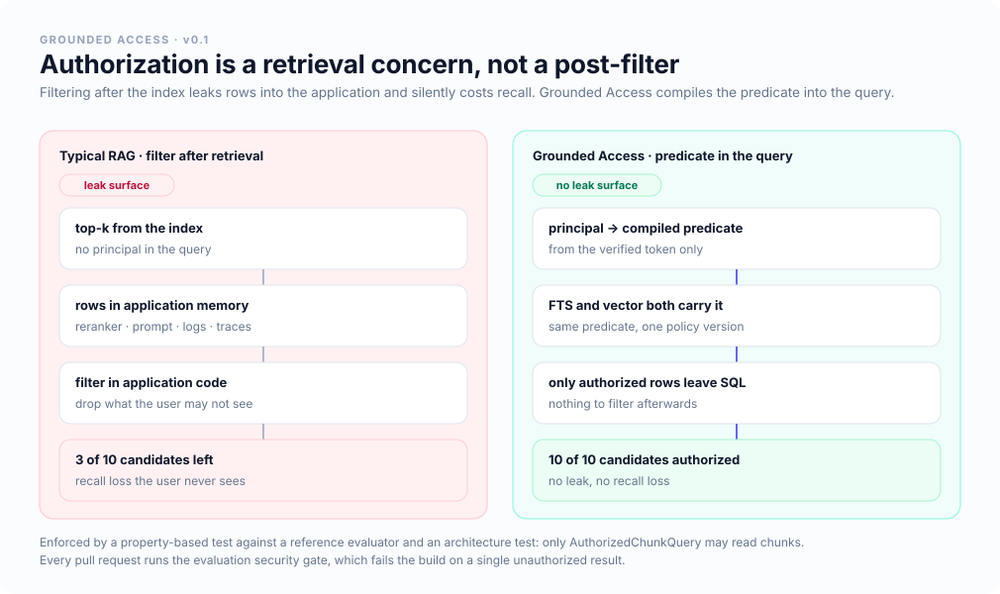
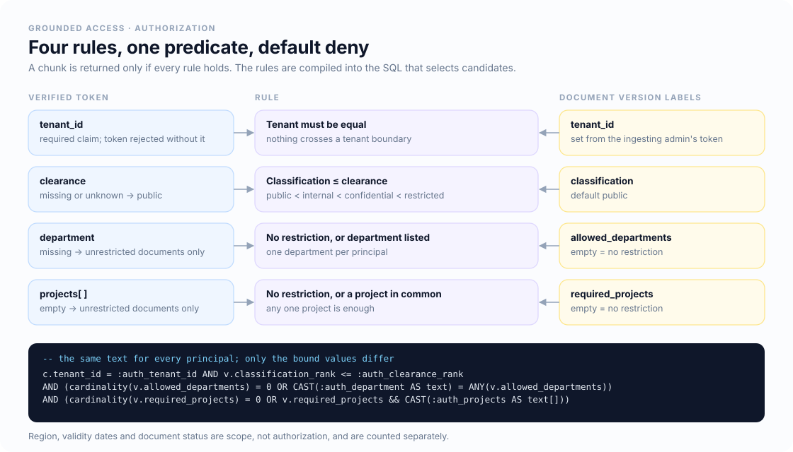
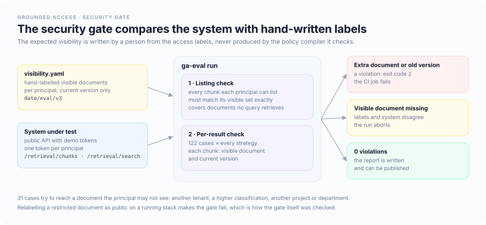
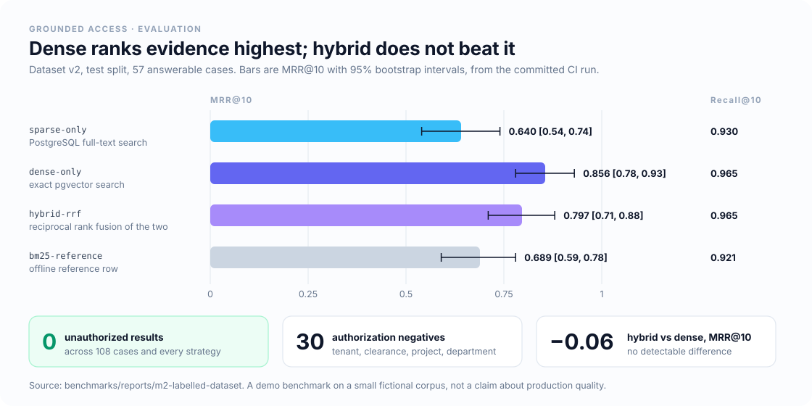
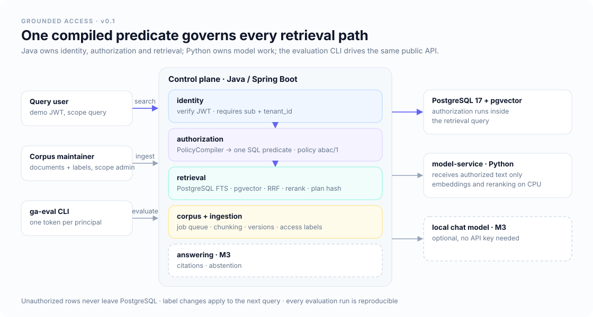
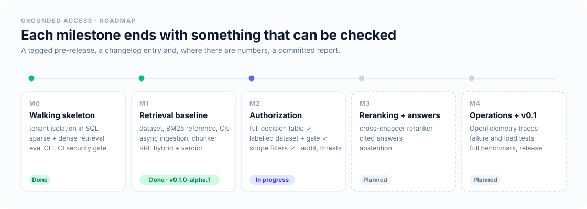

<p align="center">
    
</p>

<h1 align="center">Grounded Access</h1>

<p align="center">
    <b>Permission-aware RAG, judged by evidence.</b><br/>Authorization is compiled into the retrieval SQL, and every retrieval change is measured on a reproducible benchmark, negative results included.
</p>

<p align="center">
    <a href="https://github.com/poppycoderr/grounded-access/actions/workflows/build.yml"></a>
    <a href="https://github.com/poppycoderr/grounded-access/releases"></a>
    <a href="./LICENSE"></a>
    
    
    
    
    <a href="https://poppycoder.netlify.app/grounded-access/"></a>
</p>

<p align="center">
    <b>English</b> · <a href="./README.zh-CN.md">简体中文</a> · <a href="./docs/architecture/overview.md">Architecture</a> · <a href="./docs/evaluation/strategy.md">Evaluation</a> · <a href="./benchmarks/reports/m3-retrieval/report.md">Benchmark</a> · <a href="./docs/project/milestones.md">Milestones</a>
</p>

---

## Highlights

- 🛡️ **Authorization inside the query**: tenant, clearance, department and project rules are compiled into the SQL of every retrieval path, so unauthorized rows never leave PostgreSQL
- 🔎 **Four retrieval strategies on one database**: PostgreSQL full-text search, exact pgvector search, reciprocal rank fusion and cross-encoder reranking, each response tagged with the hash of its retrieval plan
- 📊 **Evaluation with confidence intervals**: 128 hand-checked cases, bootstrap intervals, paired comparisons and a BM25 reference row; a difference counts only if its interval excludes zero
- 🚨 **A security gate in CI**: 31 cases try to reach forbidden documents, and every returned chunk is checked against hand-written visibility; one unauthorized result fails the build
- 🧪 **Results are published as measured**: plain hybrid does not beat dense on this dataset, reranking does (MRR@10 +0.09 [+0.04, +0.15]) at ten times the latency, and one earlier claim was withdrawn when a larger dataset stopped supporting it
- ⚙️ **Real ingestion**: asynchronous jobs with retry and resume, versioned documents, label changes that apply to the next query without re-embedding
- 🚀 **Runs on a laptop**: one `docker compose up`, a CPU embedding model baked into the image, no API key and no GPU

## Same question, two identities

Nothing about the request changes except the token. This is real output from `./scripts/demo-queries`:

```text
alice-engineer (tenant northstar) · dense-only · policy abac/1
  1. hr-volunteer-policy › Volunteer Time Off Policy > European Union
     Employees based in the EU receive two paid volunteer days per calendar year.
  2. hr-volunteer-policy › Volunteer Time Off Policy > United States
     Employees based in the US receive one paid volunteer day per calendar year.

mallory-outsider (tenant external) · dense-only · policy abac/1
  1. volunteer-handbook › Community Volunteering Handbook > Volunteer days
     Orbit Labs employees receive three volunteer days per year, which can be taken as half days.
```

The outsider gets no "permission denied", no hit count and no Northstar document title. The tenant condition is part of the SQL that selects candidates, so the Northstar policy is never a row in their result set.

The same holds inside a tenant. Alice has `internal` clearance and Carol has `confidential`; both ask how much on-call allowance staff engineers receive:

```text
alice-engineer (tenant northstar) · dense-only · policy abac/1
  1. eng-oncall-handbook › On-call Handbook > Compensation
     Engineers receive an on-call allowance of 250 EUR per week of primary on-call, ...
  2. eng-oncall-handbook › On-call Handbook > Acknowledging pages
     The on-call engineer must acknowledge a page within 5 minutes. ...

carol-manager (tenant northstar) · dense-only · policy abac/1
  1. hr-compensation-bands › Compensation Bands > On-call pay
     Engineers at staff level and above receive an on-call allowance of 400 EUR per week ...
  2. eng-oncall-handbook › On-call Handbook > Compensation
     Engineers receive an on-call allowance of 250 EUR per week of primary on-call, ...
```

Alice gets the general handbook, and nothing tells her that a confidential document exists. Carol gets the confidential answer first.

## Quick start

Requirements: Docker, [uv](https://docs.astral.sh/uv/). The first build downloads Maven dependencies and a ~70 MB embedding model, which usually takes a few minutes. No API key, no GPU.

```bash
git clone https://github.com/poppycoderr/grounded-access.git
cd grounded-access

docker compose up -d --build --wait   # PostgreSQL + pgvector, control plane, CPU model service
./scripts/load-demo                   # ingest the fictional Northstar and Orbit Labs corpora
./scripts/demo-queries                # the comparison above
./scripts/benchmark                   # evaluate every strategy and enforce the security gate
```

Search as any demo identity, or mint a token and call the API yourself:

```bash
uv run --project packages/evaluation ga-eval search alice-engineer "How many paid volunteer days do EU employees receive?"

TOKEN=$(uv run scripts/mint-token.py alice-engineer --scope "query debug")
curl -s localhost:8080/api/v1/retrieval/search -H "Authorization: Bearer $TOKEN" \
  -H 'content-type: application/json' \
  -d '{"query":"paid volunteer days","strategy":"dense-only","k":3}'
```

## Why it exists

Most RAG demos retrieve first and filter afterwards. That leaks rows into application memory — and from there into rerankers, prompts and logs — while silently costing recall, because the filter eats the top-k that the index already chose.

<p align="center">
    
</p>

The predicate carries the tenant, clearance, department and project rules. The shape of the solution is the point: whatever the rules are, they belong in the query that selects candidates.

## How authorization works

A principal is compiled into one predicate with bound parameters, never string concatenation, and every chunk query embeds the same object (`policy abac/1`).

<p align="center">
    
</p>

A missing or unknown clearance counts as the lowest level, and a principal without a department or projects sees only documents that do not restrict that attribute. A change of labels applies to the next query and needs no re-embedding.

Tenant, clearance, department and project are **authorization** and count toward the security gate. Region, validity dates and document status are **scope**: they shape relevance rather than access. Keeping them apart means the security metrics only ever count real access violations. The full decision table is in [docs/architecture/authorization.md](./docs/architecture/authorization.md).

<p align="center">
    
</p>

Guards in place today:

- an architecture test — only `AuthorizedChunkQuery` may read the chunk table;
- a property-based test — random principals and labels, with every query path compared against a separate reference evaluator;
- integration tests on real pgvector — each rule of the decision table on all three strategies, cross-tenant isolation, hostile claim values, invalid and under-scoped tokens;
- the evaluation security gate — every returned chunk is checked for document and version against hand-labelled visibility, never against the compiler itself, and each principal's full chunk listing must match its visible set.

The [threat model](./docs/security/threat-model.md) lists every control with the check that verifies it, and the risks that are accepted: above all, that the demo identity setup lets anyone mint any token.

## Retrieval evaluation

<p align="center">
    
</p>

[`benchmarks/reports/m3-retrieval/`](./benchmarks/reports/m3-retrieval/) holds the committed run: `run.json` (dataset version, commit, retrieval plans, policy and chunker versions, bootstrap seed, platform and CPU), `cases.jsonl` (per-case rankings) and the rendered `report.md`. Regenerate it with `./scripts/benchmark --out benchmarks/reports/<name>`.

Dataset v4, `test` split, 70 answerable cases, 95% bootstrap intervals, produced by the CI runner (Linux x86_64):

| Strategy | Recall@10 | MRR@10 | nDCG@10 | Security violations | Scope failures |
|---|---|---|---|---|---|
| `sparse-only` (PostgreSQL FTS) | 0.929 [0.86, 0.99] | 0.690 [0.60, 0.77] | 0.749 [0.67, 0.82] | **0** | **0** |
| `dense-only` (pgvector, exact) | 0.971 [0.93, 1.00] | 0.865 [0.80, 0.93] | 0.892 [0.83, 0.94] | **0** | **0** |
| `hybrid-rrf` (reciprocal rank fusion of the two) | 0.971 [0.93, 1.00] | 0.825 [0.75, 0.89] | 0.860 [0.80, 0.91] | **0** | **0** |
| `hybrid-rrf-rerank` (cross-encoder over the fused top 20) | 0.971 [0.93, 1.00] | **0.957 [0.91, 0.99]** | **0.955 [0.91, 0.99]** | **0** | **0** |
| `bm25-reference` (offline, same authorized chunks) | 0.921 [0.86, 0.98] | 0.741 [0.66, 0.82] | 0.784 [0.71, 0.86] | **0** | **0** |

**Security.** Zero violations across 128 cases, 31 of which try to reach a document the principal may not see: in another tenant, above its clearance, in a project it is not on, or in another department. Every returned chunk is checked for document and version, and before any query runs each principal's full chunk listing is compared with its hand-labelled visible set.

**Scope.** 13 cases ask about a region or a date, or name documents that are readable but do not apply: the other region's holiday calendar, last year's travel policy, a benefit that has not started. No strategy returned one. Scope failures are counted apart from security violations and never added to them.

What the paired comparisons support, and what they do not:

- **Reranking beats the best single channel.** `hybrid-rrf-rerank` against dense: MRR@10 +0.09 [+0.04, +0.15]. It puts the right evidence first in 66 of 70 cases, where dense manages 56. Recall@10 does not move, because reranking only reorders what fusion already found. The cost is latency: 480 ms at the median against 41 ms for dense on the CI runner of this run, about ten times, and about 1 s inside Docker on a laptop.
- **Dense ranks the right evidence higher than FTS:** MRR@10 +0.18 [+0.10, +0.26]. Whether the evidence appears in the top 10 at all shows **no detectable difference** (Recall@10 +0.04 [−0.01, +0.10]).
- **Plain hybrid does not beat dense.** MRR@10 −0.04 [−0.10, +0.02] against dense: no detectable difference, with the point estimate in favour of dense. The [analysis](./docs/evaluation/m1b-hybrid-analysis.md) of the first hybrid run explains why: equal-weight fusion gives the weaker FTS channel the same vote.
- **FTS against BM25: a finding that did not hold.** On dataset v1, BM25 was measurably ahead of FTS (MRR@10 +0.10 [+0.02, +0.18]). On every later dataset version the difference is not detectable (v4: +0.05 [−0.01, +0.12]). The earlier reports stay in the repository; the claim is withdrawn until a larger dataset supports it.
- **Dense beats BM25** on MRR@10 (+0.12 [+0.04, +0.21]).

Nothing was tuned on the test split. The dataset is 35 fictional documents and 128 hand-checked cases, with 36 of the 93 answerable ones deliberately worded so they share almost no words with their evidence. It is a demo benchmark: it shows the method and the direction of the differences, not production quality. Reports on earlier dataset versions are not comparable with this one. Published numbers are reproducible to the reported precision; dense result lists can differ in the order of near-tied candidates between CPUs (see [benchmarks/README.md](./benchmarks/README.md)). See the [dataset card](./data/eval/DATASET_CARD.md) for what it covers and what it does not.

Evidence is labelled as a **document version plus a quote**, not a chunk id, so chunking strategies can be compared on the same labels. Read the method in [docs/evaluation/strategy.md](./docs/evaluation/strategy.md).

## What works today

| Capability | Today | Planned |
|---|---|---|
| Authorization in the retrieval query | Tenant, clearance, department and project rules compiled once per request into the SQL of every channel; region and validity scope compiled separately; both property-tested against a reference evaluator | A uniform "no answer" on the answering path (M3) |
| Retrieval | `sparse-only` (PostgreSQL FTS), `dense-only` (exact pgvector), `hybrid-rrf` (reciprocal rank fusion with overlap deduplication) and `hybrid-rrf-rerank` (a cross-encoder over the top fused candidates, falling back to the fused order); every response carries a plan hash | – |
| Ingestion | Asynchronous jobs (`202` + poll) with a `SKIP LOCKED` worker, bounded retry and resume; content-hash versioning; Markdown and plain-text chunking with sentence-level splitting and overlap; disable and delete apply to the next query, with background cleanup | – |
| Evaluation | 128 cases over 35 labelled documents: paraphrases, hard negatives, 31 authorization negatives, 13 scope cases and 6 prompt-injection cases; a BM25 reference row, bootstrap intervals and paired comparisons; a security gate in CI that checks every returned chunk and every principal's full listing | Answer metrics: citation validity, abstention (M3) |
| Answers | `/api/v1/query`: statements that cite authorized evidence, a refusal when the evidence does not answer, or evidence alone when no chat model is configured. Generation is optional and uses any OpenAI-compatible endpoint. Answer metrics come from local runs that name their model | A check that each statement is supported by the passage it cites (after v0.1) |
| Operations | Docker Compose, CI on every PR; a trace id per request, audit events and execution records written synchronously and failing closed | OpenTelemetry traces, dashboards (M4) |

**Generated answers are not reliable yet, and the project measures that.** In the committed local run with `llama3:8b`, no hidden content leaked and every citation resolved, but 10 of 24 questions that should have been refused were answered from a readable look-alike document, and 2 of 5 planted instructions added a false statement. Citation validation proves that a statement points at authorized evidence, not that the evidence supports it. See the [answer analysis](./docs/evaluation/m3-answers-analysis.md).

## Architecture

<p align="center">
    
</p>

| Component | Stack | Role |
|---|---|---|
| `apps/control-plane` | Java 21 (CI on 21 and 25), Spring Boot 4.1 | Token verification, policy compilation, ingestion, retrieval, API |
| `apps/model-service` | Python 3.12, FastAPI, ONNX Runtime | Embeddings and cross-encoder scores; no identities, no database access |
| `packages/contracts` | OpenAPI | The contract between them, with a drift test on both sides |
| `packages/evaluation` | Python 3.12 | `ga-eval`: dataset validation, retrieval metrics, security gate, reports |
| Storage | PostgreSQL 17 + pgvector | Documents, versions, chunks, full-text and vector search |

```text
io.groundedaccess
├── identity        # verify the JWT → Principal (attributes only from the token)
├── authorization   # PolicyCompiler → one parameterized SQL predicate
├── corpus          # normalize · chunking · versions and access labels · cleanup
├── ingestion       # job queue: SKIP LOCKED worker, leases, retry and resume
├── retrieval       # AuthorizedChunkQuery: the only reader of the chunk table · RRF · plan hash
├── modelclient     # model-service client: batching, timeouts, pinned model
└── api             # REST controllers, scopes, problem responses
```

## Roadmap

<p align="center">
    
</p>

| Milestone | Scope | Status |
|---|---|---|
| **M0** Walking skeleton | Demo identities, Markdown ingestion, sparse and dense retrieval, tenant isolation, eval CLI, CI security gate | ✅ Done |
| **M1** Retrieval baseline | Dataset with hard negatives, BM25 reference, confidence intervals; async ingestion, disable and delete, chunker v1; RRF hybrid with a published verdict | ✅ Done · `v0.1.0-alpha.1` |
| **M2** Authorization | Full decision table, property-based tests, labelled dataset v2 and the stricter gate, scope filters with `asOf`, audit events, existence-safe document reads, threat model, dataset v3 with scope cases, published report | ✅ Done · `v0.1.0-alpha.2` |
| **M3** Reranking and answers | Cross-encoder reranking with fallback and a published result; cited answers with validation and refusal, prompt-injection test documents, answer metrics and a published local run | ✅ Done |
| **M4** Operations and release | Traces and dashboards, failure and load tests, v0.1 benchmark report | Planned |

Not in the first phase: knowledge graphs or GraphRAG, autonomous agents, extra vector databases, OCR and multimodal input, fine-tuning, Kubernetes and multi-cloud, a no-code builder. See [docs/project/milestones.md](./docs/project/milestones.md).

## Documentation

- [Architecture overview](./docs/architecture/overview.md) — trust boundaries, data model, ingestion and query flows, failure behaviour
- [Authorization model](./docs/architecture/authorization.md) — invariants, decision table, compiled SQL, what is verified today
- [Threat model](./docs/security/threat-model.md) — assets, actors, abuse cases with their checks, residual risks
- [Answer analysis](./docs/evaluation/m3-answers-analysis.md) — what generated answers got right and wrong in a local run
- [Evaluation strategy](./docs/evaluation/strategy.md) — case schema, metrics, CI gates, reproducibility rules
- [Architecture decisions](./docs/adr/) — modular monolith, PostgreSQL FTS + pgvector, retrieval-time authorization, the Python model service, what `asOf` means
- [Milestones](./docs/project/milestones.md) and [open questions](./docs/project/open-questions.md)

## Contributing

Issues and pull requests are welcome, and the most useful ones right now are evaluation cases that break the retrieval baseline, and arguments against the design decisions in the ADRs. Read [CONTRIBUTING.md](./CONTRIBUTING.md) and [AGENTS.md](./AGENTS.md) first — the rules in `AGENTS.md` apply to humans and AI agents alike.

Security reports go through [GitHub security advisories](https://github.com/poppycoderr/grounded-access/security/advisories/new). The demo identity setup is insecure by design; see [SECURITY.md](./SECURITY.md).

## Related projects

- [domain-driven-kit](https://github.com/poppycoderr/domain-driven-kit) — executable DDD for Spring Boot. Grounded Access reuses its engineering conventions (architecture tests, null safety, CI layout) without depending on it.

## Built with

<p>
    <a href="https://spring.io/projects/spring-boot"></a>
    <a href="https://www.postgresql.org"></a>
    <a href="https://github.com/pgvector/pgvector"></a>
    <a href="https://fastapi.tiangolo.com"></a>
    <a href="https://onnxruntime.ai"></a>
    <a href="https://testcontainers.com"></a>
    <a href="https://jqwik.net"></a>
    <a href="https://github.com/features/actions"></a>
    <a href="https://claude.com/claude-code"></a>
    <a href="https://openai.com/codex"></a>
</p>

## License

[Apache-2.0](./LICENSE). The fictional demo corpus in `data/corpus` is published under CC BY 4.0 and describes companies that do not exist.
