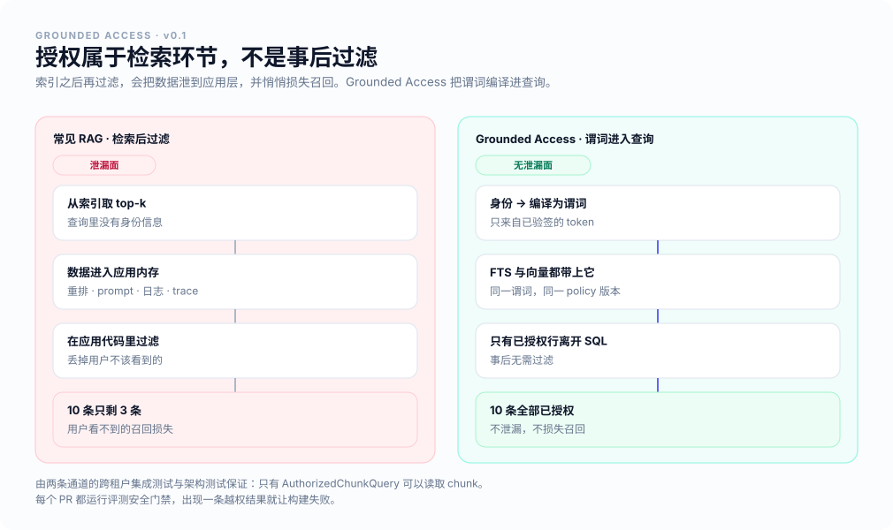
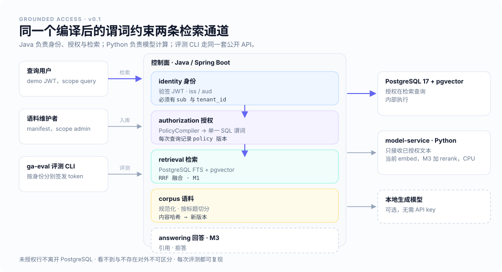

<p align="center">
    
</p>

<h1 align="center">Grounded Access</h1>

<p align="center">
    <b>在检索查询内部执行授权，并用可复现的评测检验每一次检索改动。</b><br/>
    <b>当前可用：</b>SQL 内的租户隔离、PostgreSQL FTS 与 pgvector 精确检索、带置信区间的 70 条用例评测。<b>下一步：</b>hybrid 排序与完整的属性决策表。
</p>

<p align="center">
    <a href="https://github.com/poppycoderr/grounded-access/actions/workflows/build.yml"></a>
    <a href="./LICENSE"></a>
    
</p>

<p align="center">
    <a href="./README.md">English</a> · <b>简体中文</b> · <a href="./docs/architecture/overview.md">架构</a> · <a href="./docs/evaluation/strategy.md">评测</a> · <a href="./benchmarks/reports/m1a-baseline/report.md">基准报告</a> · <a href="./docs/project/milestones.md">里程碑</a>
</p>

---

## 同一个问题，两种身份

除了 token，请求没有任何差别。以下是 `./scripts/demo-queries` 的真实输出：

```text
alice-engineer (tenant northstar) · dense-only · policy tenant-only/1
  1. hr-volunteer-policy › Volunteer Time Off Policy > European Union
     Employees based in the EU receive two paid volunteer days per calendar year.
  2. hr-volunteer-policy › Volunteer Time Off Policy > United States
     Employees based in the US receive one paid volunteer day per calendar year.

mallory-outsider (tenant external) · dense-only · policy tenant-only/1
  1. volunteer-handbook › Community Volunteering Handbook > Volunteer days
     Orbit Labs employees receive three volunteer days per year, which can be taken as half days.
```

外部身份拿到的不是「权限不足」，没有命中数量，也看不到任何 Northstar 文档的标题。租户条件是筛选候选的那条 SQL 的一部分，因此 Northstar 的政策从来没有成为他结果集里的一行。

## 当前已实现的能力

| 能力 | 当前可用 | 计划中 |
|---|---|---|
| 检索查询内的授权 | 租户隔离，每次请求编译一次，两条通道共用 | 密级、部门、项目标签（M2） |
| 检索 | `sparse-only`（PostgreSQL FTS）与 `dense-only`（pgvector 精确检索） | RRF hybrid（M1）、cross-encoder 重排（M3） |
| 入库 | Markdown 与纯文本，同步执行，内容哈希版本管理，按标题切分 | 带重试的任务队列（M1）、停用与删除清理（M1） |
| 评测 | 21 篇文档 70 条用例、hard negatives、BM25 参考行、bootstrap 置信区间与配对比较、CI 安全门禁 | 同一报告中加入 hybrid（M1b）、标签级授权负例（M2） |
| 回答 | `/api/v1/retrieval/search` 返回排序后的证据 | 带引用与拒答的 `/api/v1/query`（M3） |
| 运维 | Docker Compose、每个 PR 的 CI | OpenTelemetry trace、审计事件、dashboard（M2–M4） |

以下是设计目标，但**尚未端到端验证**，括号内是负责验证它的里程碑：隐藏无权访问内容的存在性（M2–M3）、基于属性的访问决策（M2）、回答只引用模型实际看到的内容（M3）。

## 快速开始

环境要求：Docker、[uv](https://docs.astral.sh/uv/)。首次构建需要下载 Maven 依赖和约 70 MB 的 embedding 模型，通常需要几分钟。无需 API key，无需 GPU。

```bash
git clone https://github.com/poppycoderr/grounded-access.git
cd grounded-access

docker compose up -d --build --wait   # PostgreSQL + pgvector、控制面、CPU 模型服务
./scripts/load-demo                   # 导入 Northstar 与 Orbit Labs 两套虚构语料
./scripts/demo-queries                # 上面那组对照
./scripts/benchmark                   # 评测所有策略并执行安全门禁
```

以任意 demo 身份检索，或者自己签发 token 调用 API：

```bash
uv run --project packages/evaluation ga-eval search alice-engineer "How many paid volunteer days do EU employees receive?"

TOKEN=$(uv run scripts/mint-token.py alice-engineer --scope "query debug")
curl -s localhost:8080/api/v1/retrieval/search -H "Authorization: Bearer $TOKEN" \
  -H 'content-type: application/json' \
  -d '{"query":"paid volunteer days","strategy":"dense-only","k":3}'
```

## 为什么做这个项目

多数 RAG demo 先检索、再过滤。这会把数据泄漏到应用内存——并进一步进入重排、prompt 和日志——同时悄悄损失召回，因为过滤吃掉的正是索引已经选出的 top-k。

<p align="center">
    
</p>

当前谓词里只有租户条件，M2 会把密级、部门、项目加进同一个编译对象。重点是解法的形状：无论规则是什么，它都应该待在筛选候选的那条查询里。

## 检索评测

[`benchmarks/reports/m1a-baseline/`](./benchmarks/reports/m1a-baseline/) 保存了提交在仓库中的运行结果：`run.json`（数据集版本、commit、策略、policy 版本、bootstrap 种子、运行平台）、`cases.jsonl`（逐用例排名）与渲染出的 `report.md`。用 `./scripts/benchmark --out benchmarks/reports/<名称>` 可重新生成。

`test` 划分，47 条可回答用例，95% bootstrap 区间，由 CI runner（Linux x86_64）生成：

| 策略 | Recall@10 | MRR@10 | nDCG@10 | 越权结果 |
|---|---|---|---|---|
| `sparse-only`（PostgreSQL FTS） | 0.936 [0.85, 1.00] | 0.616 [0.51, 0.72] | 0.697 [0.61, 0.79] | **0** |
| `dense-only`（pgvector 精确检索） | 0.979 [0.94, 1.00] | 0.860 [0.77, 0.94] | 0.891 [0.82, 0.95] | **0** |
| `bm25-reference`（离线，同一批已授权 chunk） | 0.926 [0.85, 0.99] | 0.716 [0.61, 0.82] | 0.765 [0.67, 0.85] | **0** |

配对比较能支持什么、不能支持什么：

- **dense 把正确证据排得比 FTS 更靠前**：MRR@10 +0.24 [+0.13, +0.35]。但证据是否出现在前 10 条，**看不出可检测的差异**（Recall@10 +0.04 [−0.04, +0.13]）。
- **PostgreSQL FTS 确实弱于 BM25**：BM25 的 MRR@10 高 +0.10 [+0.02, +0.18]。这正是 ADR-0002 基于「FTS 没有语料统计」所预测的差距，因此将来 hybrid 的提升必须对照 BM25 这一行来看，而不能只和 FTS 比。
- **dense 也优于 BM25**（MRR@10 +0.14）。下一步（M1b）加入 hybrid，在同一批用例上评判。

数据集是 21 篇虚构文档、70 条人工核对的用例，63 条可回答用例中有 30 条刻意写得与证据几乎没有共同词汇。这是 demo benchmark：它展示的是方法与差异的方向，而不是生产效果。关键词与 BM25 的排名在任何机器上都完全一致；dense 的排名在不同 CPU 架构之间可能交换得分几乎相同的候选，在 Mac 上会让一条用例的结果不同（见 [benchmarks/README.md](./benchmarks/README.md)）。覆盖范围与局限见[数据集说明卡](./data/eval/DATASET_CARD.md)。

证据以**文档版本 + 原文引用**标注，而不是 chunk id，因此不同切分策略可以在同一份标注上比较。方法见 [docs/evaluation/strategy.md](./docs/evaluation/strategy.md)。

## 架构

<p align="center">
    
</p>

| 组件 | 技术栈 | 职责 |
|---|---|---|
| `apps/control-plane` | Java 21（CI 跑 21 与 25）、Spring Boot 4.1 | 验签、编译授权谓词、入库、检索、API |
| `apps/model-service` | Python 3.12、FastAPI、ONNX Runtime | 当前提供 embedding，M3 加入重排；不持有身份，不访问数据库 |
| `packages/contracts` | OpenAPI | 两者之间的契约，双侧都有漂移检测 |
| `packages/evaluation` | Python 3.12 | `ga-eval`：数据集校验、检索指标、安全门禁、报告 |
| 存储 | PostgreSQL 17 + pgvector | 文档、版本、chunk、全文与向量检索 |

```text
io.groundedaccess
├── identity        # 验签 JWT → Principal（属性只来自 token）
├── authorization   # PolicyCompiler → 单一参数化 SQL 谓词
├── corpus          # 规范化 · 按标题切分 · 内容哈希版本管理
├── retrieval       # AuthorizedChunkQuery：chunk 表唯一的读取方
├── modelclient     # model-service 客户端：分批、超时、固定模型
└── api             # REST controller、作用域、问题响应
```

## 权限如何生效

身份被编译成带绑定参数的谓词（绝不做字符串拼接），两条通道嵌入的是同一个对象。

当前已实现（`policy tenant-only/1`）：

```sql
c.tenant_id = :auth_tenant_id
```

M2 计划加入同一个编译谓词：

```sql
AND v.classification_rank <= :clearance_rank
AND (cardinality(v.allowed_departments) = 0 OR :department = ANY(v.allowed_departments))
AND (cardinality(v.required_projects)  = 0 OR v.required_projects && :projects::text[])
```

租户、密级、部门、项目属于**授权**，计入安全门禁；region、有效期与文档状态属于**适用范围**，它们影响相关性而非访问权。把两者分开，安全指标才只统计真正的越权。完整决策表见 [docs/architecture/authorization.md](./docs/architecture/authorization.md)。

当前已有的防线：

- 架构测试——只有 `AuthorizedChunkQuery` 可以读取 chunk 表；
- 真实 pgvector 上的集成测试——两条通道的跨租户隔离、无效与权限不足的 token、版本替换；
- 评测安全门禁——返回的文档与人工标注的可见性比较，而不是与编译器自己比较。

M2 计划补上：决策表的 property-based 测试、细到版本与 chunk 粒度的门禁、撤权一致性测试。

## 路线图

| 里程碑 | 范围 | 状态 |
|---|---|---|
| **M0** Walking skeleton | demo 身份、Markdown 入库、sparse 与 dense 检索、租户隔离、评测 CLI、CI 冒烟 benchmark | ✅ 已完成 |
| **M1a** 评测基线 | 70 条用例与 hard negatives、BM25 参考行、配对置信区间、并发入库安全 | ✅ 已完成 |
| **M1b** hybrid 检索 | 异步入库任务、删除清理、chunker v1、同一报告中的 RRF hybrid | ⏳ 进行中 |
| **M2** 授权 | 访问标签、完整决策表、适用范围过滤、审计事件、最小 trace 元数据、威胁模型 | 计划中 |
| **M3** 重排与回答 | 带降级的 cross-encoder 重排、上下文构建、结构化引用、拒答 | 计划中 |
| **M4** 运维与发布 | trace 与 dashboard、故障与压力测试、v0.1 benchmark 报告 | 计划中 |

第一阶段明确不做：知识图谱与 GraphRAG、自主 Agent、更多向量数据库、OCR 与多模态、模型微调、Kubernetes 与多云、低代码编排。详见 [docs/project/milestones.md](./docs/project/milestones.md)。

## 文档

- [架构总览](./docs/architecture/overview.md)——信任边界、数据模型、入库与查询链路、故障行为
- [授权模型](./docs/architecture/authorization.md)——不变量、决策表、编译后的 SQL、当前已验证的范围
- [评测策略](./docs/evaluation/strategy.md)——用例格式、指标、CI 门禁、可复现规则
- [架构决策记录](./docs/adr/)——模块化单体、PostgreSQL FTS + pgvector、检索时授权、Python 模型服务
- [里程碑](./docs/project/milestones.md)与[待决问题](./docs/project/open-questions.md)

## 参与贡献

欢迎提 issue 和 PR。当前最有价值的贡献，是能打穿现有检索 baseline 的评测用例，以及对 ADR 中设计决策的反驳。请先阅读 [CONTRIBUTING.md](./CONTRIBUTING.md) 与 [AGENTS.md](./AGENTS.md)——`AGENTS.md` 中的规则对人类与 AI 代理同样适用。

安全问题请通过 [GitHub security advisories](https://github.com/poppycoderr/grounded-access/security/advisories/new) 提交。demo 身份体系按设计就是不安全的，见 [SECURITY.md](./SECURITY.md)。

## 相关项目

- [domain-driven-kit](https://github.com/poppycoderr/domain-driven-kit)——面向 Spring Boot 的可执行 DDD 工具箱。Grounded Access 复用它的工程约定（架构测试、空安全、CI 结构），但不依赖它。

## 许可证

[Apache-2.0](./LICENSE)。`data/corpus` 下的虚构语料以 CC BY 4.0 发布，其中的公司均不存在。
