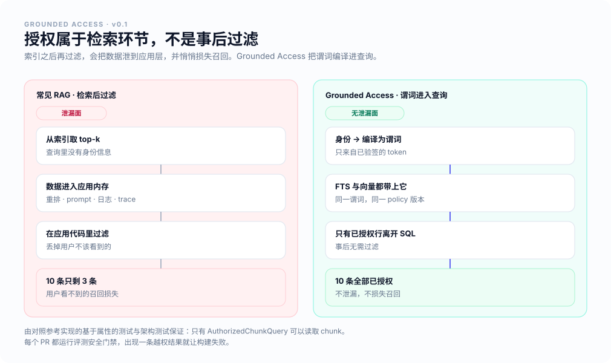
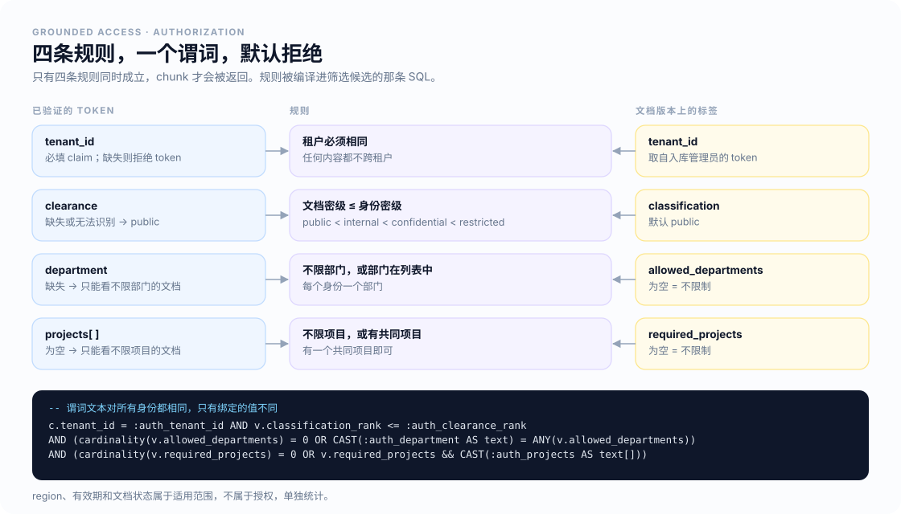
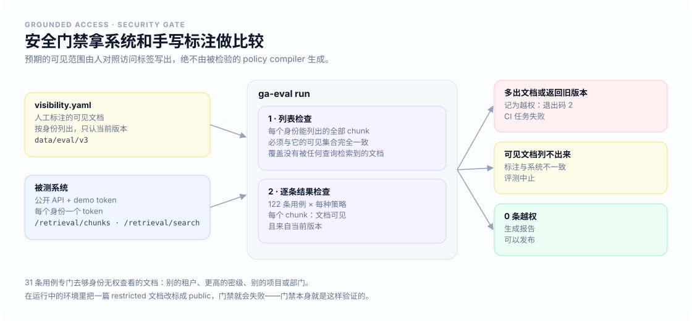
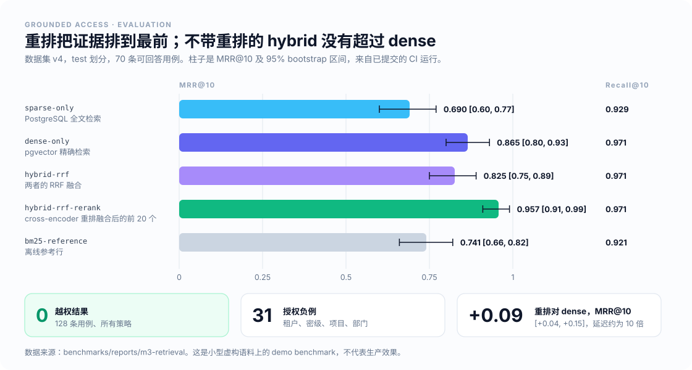
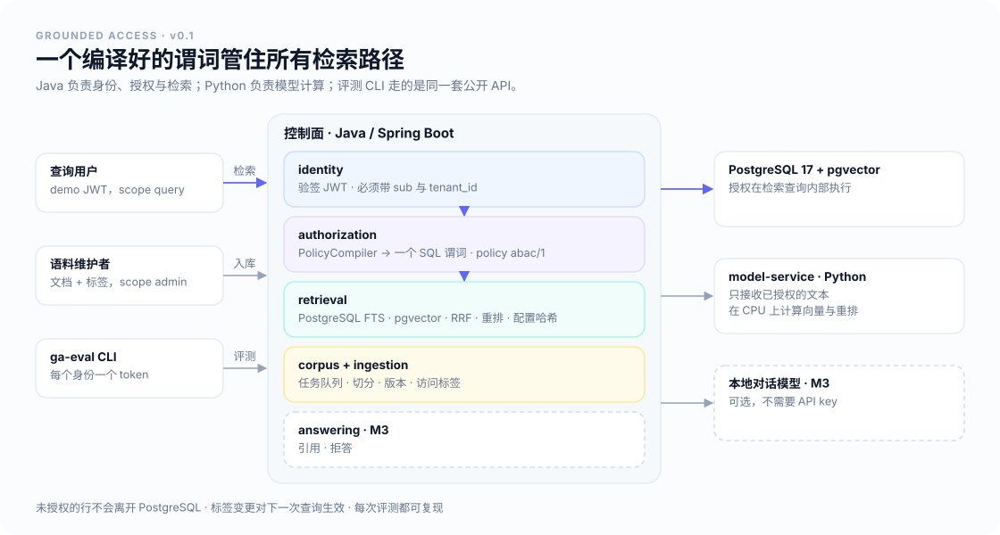
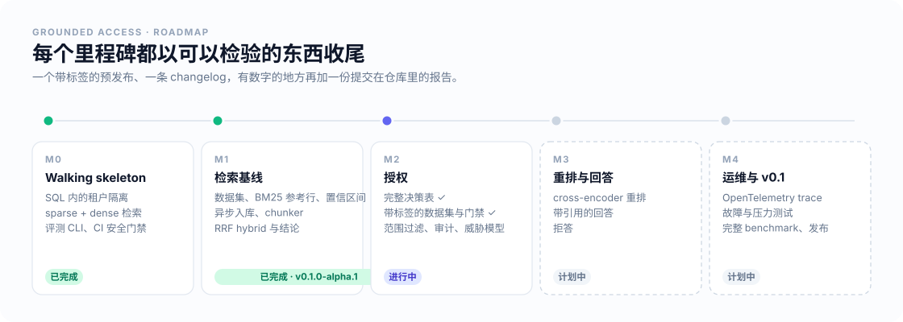

<p align="center">
    
</p>

<h1 align="center">Grounded Access</h1>

<p align="center">
    <b>感知权限的 RAG，用证据说话。</b><br/>授权被编译进检索 SQL；每一次检索改动都在可复现的 benchmark 上衡量，负面结果照样公布。
</p>

<p align="center">
    <a href="https://github.com/poppycoderr/grounded-access/actions/workflows/build.yml"></a>
    <a href="https://github.com/poppycoderr/grounded-access/releases"></a>
    <a href="./LICENSE"></a>
    
    
    
    
    <a href="https://poppycoder.netlify.app/grounded-access/"></a>
</p>

<p align="center">
    <a href="./README.md">English</a> · <b>简体中文</b> · <a href="./docs/architecture/overview.md">架构</a> · <a href="./docs/evaluation/strategy.md">评测</a> · <a href="./benchmarks/reports/m2-authorization/report.md">基准报告</a> · <a href="./docs/project/milestones.md">里程碑</a>
</p>

---

## 亮点

- 🛡️ **授权写在查询里**：租户、密级、部门、项目四条规则被编译进每条检索路径的 SQL，未授权的行不会离开 PostgreSQL
- 🔎 **一个数据库上的三种检索策略**：PostgreSQL 全文检索、pgvector 精确检索和 RRF 融合，每个响应都带检索配置的哈希
- 📊 **带置信区间的评测**：122 条人工核对的用例、bootstrap 区间、配对比较和 BM25 参考行；区间不跨零才算有差异
- 🚨 **CI 里的安全门禁**：31 条用例专门去够无权查看的文档，每个返回的 chunk 都对照手写的可见性标注检查；出现一条越权结果，构建就失败
- 🧪 **负面结果照样公布**：在这份数据集上 hybrid 没有超过 dense；还有一条早先的结论，在更大的数据集不再支持它之后被撤回
- ⚙️ **真实的入库流程**：带重试和断点续跑的异步任务、带版本的文档、标签变更对下一次查询生效且不需要重新计算向量
- 🚀 **笔记本上就能跑**：一条 `docker compose up`，CPU embedding 模型已打进镜像，不需要 API key，也不需要 GPU

## 同一个问题，两种身份

除了 token，请求没有任何差别。以下是 `./scripts/demo-queries` 的真实输出：

```text
alice-engineer (tenant northstar) · dense-only · policy abac/1
  1. hr-volunteer-policy › Volunteer Time Off Policy > European Union
     Employees based in the EU receive two paid volunteer days per calendar year.
  2. hr-volunteer-policy › Volunteer Time Off Policy > United States
     Employees based in the US receive one paid volunteer day per calendar year.

mallory-outsider (tenant external) · dense-only · policy abac/1
  1. volunteer-handbook › Community Volunteering Handbook > Volunteer days
     Orbit Labs employees receive three volunteer days per year, which can be taken as half days.
```

外部身份拿到的不是「权限不足」，没有命中数量，也看不到任何 Northstar 文档的标题。租户条件是筛选候选的那条 SQL 的一部分，因此 Northstar 的政策从来没有成为他结果集里的一行。

在同一个租户内部也是如此。Alice 的密级是 `internal`，Carol 是 `confidential`；两人都问「staff 级别的工程师 on-call 津贴是多少」：

```text
alice-engineer (tenant northstar) · dense-only · policy abac/1
  1. eng-oncall-handbook › On-call Handbook > Compensation
     Engineers receive an on-call allowance of 250 EUR per week of primary on-call, ...
  2. eng-oncall-handbook › On-call Handbook > Acknowledging pages
     The on-call engineer must acknowledge a page within 5 minutes. ...

carol-manager (tenant northstar) · dense-only · policy abac/1
  1. hr-compensation-bands › Compensation Bands > On-call pay
     Engineers at staff level and above receive an on-call allowance of 400 EUR per week ...
  2. eng-oncall-handbook › On-call Handbook > Compensation
     Engineers receive an on-call allowance of 250 EUR per week of primary on-call, ...
```

Alice 拿到的是通用手册，没有任何信息提示她还有一篇机密文档。Carol 拿到的第一条就是机密文档里的答案。

## 快速开始

环境要求：Docker、[uv](https://docs.astral.sh/uv/)。首次构建需要下载 Maven 依赖和约 70 MB 的 embedding 模型，通常需要几分钟。无需 API key，无需 GPU。

```bash
git clone https://github.com/poppycoderr/grounded-access.git
cd grounded-access

docker compose up -d --build --wait   # PostgreSQL + pgvector、控制面、CPU 模型服务
./scripts/load-demo                   # 导入 Northstar 与 Orbit Labs 两套虚构语料
./scripts/demo-queries                # 上面那组对照
./scripts/benchmark                   # 评测所有策略并执行安全门禁
```

以任意 demo 身份检索，或者自己签发 token 调用 API：

```bash
uv run --project packages/evaluation ga-eval search alice-engineer "How many paid volunteer days do EU employees receive?"

TOKEN=$(uv run scripts/mint-token.py alice-engineer --scope "query debug")
curl -s localhost:8080/api/v1/retrieval/search -H "Authorization: Bearer $TOKEN" \
  -H 'content-type: application/json' \
  -d '{"query":"paid volunteer days","strategy":"dense-only","k":3}'
```

## 为什么做这个项目

多数 RAG demo 先检索、再过滤。这会把数据泄漏到应用内存——并进一步进入重排、prompt 和日志——同时悄悄损失召回，因为过滤吃掉的正是索引已经选出的 top-k。

<p align="center">
    
</p>

谓词里已经包含租户、密级、部门和项目四条规则。重点是解法的形状：无论规则是什么，它都应该待在筛选候选的那条查询里。

## 权限如何生效

身份被编译成一个带绑定参数的谓词（绝不做字符串拼接），每条 chunk 查询嵌入的都是同一个对象（`policy abac/1`）。

<p align="center">
    
</p>

缺失或无法识别的密级按最低级处理；没有部门或项目的身份，只能看到不限制该属性的文档。标签变更对下一次查询生效，不需要重新计算向量。

租户、密级、部门、项目属于**授权**，计入安全门禁；region、有效期与文档状态属于**适用范围**，它们影响相关性而非访问权。把两者分开，安全指标才只统计真正的越权。完整决策表见 [docs/architecture/authorization.md](./docs/architecture/authorization.md)。

<p align="center">
    
</p>

当前已有的防线：

- 架构测试——只有 `AuthorizedChunkQuery` 可以读取 chunk 表；
- 基于属性的测试——随机生成身份和标签，把每条查询路径的结果与一份独立的参考实现对照；
- 真实 pgvector 上的集成测试——决策表的每条规则在三种策略上的表现、跨租户隔离、恶意的 claim 值、无效与权限不足的 token；
- 评测安全门禁——每个返回的 chunk 都按文档和版本与人工标注的可见集合比较，绝不与编译器自己比较；每个身份能列出的全部 chunk 也必须与它的可见集合一致。

[威胁模型](./docs/security/threat-model.md)列出了每一项控制措施和验证它的检查，也列出了被接受的风险：首先就是 demo 身份方案允许任何人签发任意 token。

## 检索评测

<p align="center">
    
</p>

[`benchmarks/reports/m2-authorization/`](./benchmarks/reports/m2-authorization/) 保存了提交在仓库中的运行结果：`run.json`（数据集版本、commit、检索配置、policy 与 chunker 版本、bootstrap 种子、平台与 CPU）、`cases.jsonl`（逐条排名）和渲染出的 `report.md`。用 `./scripts/benchmark --out benchmarks/reports/<name>` 可以重新生成。

数据集 v3，`test` 划分，65 条可回答用例，95% bootstrap 区间，由 CI runner（Linux x86_64）生成：

| 策略 | Recall@10 | MRR@10 | nDCG@10 | 越权结果 | 范围失败 |
|---|---|---|---|---|---|
| `sparse-only`（PostgreSQL FTS） | 0.923 [0.85, 0.98] | 0.683 [0.59, 0.77] | 0.742 [0.66, 0.82] | **0** | **0** |
| `dense-only`（pgvector 精确检索） | 0.969 [0.92, 1.00] | 0.873 [0.80, 0.94] | 0.898 [0.84, 0.95] | **0** | **0** |
| `hybrid-rrf`（两者的 RRF 融合） | 0.969 [0.92, 1.00] | 0.822 [0.74, 0.89] | 0.857 [0.79, 0.91] | **0** | **0** |
| `bm25-reference`（离线，同一批已授权 chunk） | 0.931 [0.87, 0.98] | 0.720 [0.63, 0.80] | 0.770 [0.69, 0.84] | **0** | **0** |

**安全。** 122 条用例的越权结果为 0，其中 31 条专门去够身份无权查看的文档：在别的租户、高于自己的密级、不在自己参与的项目里，或者属于别的部门。每个返回的 chunk 都按文档和版本检查；在任何查询运行之前，每个身份能列出的全部 chunk 还会和人工标注的可见集合比较。

**适用范围。** 13 条用例询问某个地区或某个日期，或者指明了「可以读但不适用」的文档：另一个地区的假期日历、去年的差旅制度、尚未生效的福利。没有任何策略返回过这类文档。范围失败与安全越权分开统计，不会加在一起。

配对比较能支持什么、不能支持什么：

- **dense 把正确证据排得比 FTS 更靠前**：MRR@10 +0.19 [+0.11, +0.28]。但证据是否出现在前 10 条，**看不出可检测的差异**（Recall@10 +0.05 [−0.02, +0.11]）。
- **hybrid 没有超过 dense。** 相对 dense，MRR@10 为 −0.05 [−0.11, +0.01]：没有可检测的差异，点估计偏向 dense。对第一次 hybrid 运行的[分析](./docs/evaluation/m1b-hybrid-analysis.md)解释了原因：等权融合让较弱的 FTS 通道拥有同样的投票权。
- **FTS 与 BM25：一个没能站住的结论。** 在数据集 v1 上，BM25 明显领先 FTS（MRR@10 +0.10 [+0.02, +0.18]）。在 v2 和 v3 上这个差异不再可检测（v3：+0.04 [−0.02, +0.10]）。旧报告仍保留在仓库里；在更大的数据集支持它之前，这个结论撤回。
- **dense 优于 BM25**：MRR@10 +0.15 [+0.07, +0.24]。

没有任何参数是在 test 划分上调的。数据集是 32 篇虚构文档、122 条人工核对的用例，87 条可回答用例中有 36 条刻意写得与证据几乎没有共同词汇。这是 demo benchmark：它展示的是方法与差异的方向，而不是生产效果。更早数据集版本上的报告不能与这一份直接比较。已发布的数字在报告的精度内可复现；dense 的结果列表在不同 CPU 之间，得分接近的候选顺序可能不同（见 [benchmarks/README.md](./benchmarks/README.md)）。覆盖范围与局限见[数据集说明卡](./data/eval/DATASET_CARD.md)。

证据以**文档版本 + 原文引用**标注，而不是 chunk id，因此不同切分策略可以在同一份标注上比较。方法见 [docs/evaluation/strategy.md](./docs/evaluation/strategy.md)。

## 当前已实现的能力

| 能力 | 当前可用 | 计划中 |
|---|---|---|
| 检索查询内的授权 | 租户、密级、部门、项目四条规则，每次请求编译一次，写进每条通道的 SQL；region 与有效期作为适用范围单独编译；两者都用基于属性的测试对照参考实现验证 | 回答链路上一致的「无法回答」（M3） |
| 检索 | `sparse-only`（PostgreSQL FTS）、`dense-only`（pgvector 精确检索）与 `hybrid-rrf`（RRF 融合并去除重叠 chunk）；每个响应带检索配置哈希 | cross-encoder 重排（M3） |
| 入库 | 异步任务（`202` + 轮询），`SKIP LOCKED` worker、有限重试与断点续跑；内容哈希版本管理；Markdown 与纯文本切分，按句拆分长段落并带重叠；停用与删除对下一次查询生效，后台清理 | – |
| 评测 | 32 篇带标签的文档、122 条用例：改写、hard negatives、31 条授权负例与 13 条适用范围用例；BM25 参考行、bootstrap 置信区间与配对比较；CI 安全门禁逐个检查返回的 chunk 和每个身份的完整可见列表 | 回答指标：引用有效性、拒答（M3） |
| 回答 | `/api/v1/retrieval/search` 返回排序后的证据 | 带引用与拒答的 `/api/v1/query`（M3） |
| 运维 | Docker Compose、每个 PR 的 CI；每个请求一个 trace id，审计事件与执行记录同步写入，写失败则拒绝请求 | OpenTelemetry trace、dashboard（M4） |

以下是设计目标，但**尚未端到端验证**，括号内是负责验证它的里程碑：无论内容是被隐藏还是不存在，都给出一致的「无法回答」（M3）；回答只引用模型实际看到的内容（M3）。

## 架构

<p align="center">
    
</p>

| 组件 | 技术栈 | 职责 |
|---|---|---|
| `apps/control-plane` | Java 21（CI 跑 21 与 25）、Spring Boot 4.1 | 验签、编译授权谓词、入库、检索、API |
| `apps/model-service` | Python 3.12、FastAPI、ONNX Runtime | 提供 embedding 与 cross-encoder 打分；不持有身份，不访问数据库 |
| `packages/contracts` | OpenAPI | 两者之间的契约，双侧都有漂移检测 |
| `packages/evaluation` | Python 3.12 | `ga-eval`：数据集校验、检索指标、安全门禁、报告 |
| 存储 | PostgreSQL 17 + pgvector | 文档、版本、chunk、全文与向量检索 |

```text
io.groundedaccess
├── identity        # 验签 JWT → Principal（属性只来自 token）
├── authorization   # PolicyCompiler → 单一参数化 SQL 谓词
├── corpus          # 规范化 · 切分 · 版本与访问标签 · 清理
├── ingestion       # 任务队列：SKIP LOCKED worker、租约、重试与断点续跑
├── retrieval       # AuthorizedChunkQuery：chunk 表唯一的读取方 · RRF · 配置哈希
├── modelclient     # model-service 客户端：分批、超时、固定模型
└── api             # REST controller、作用域、问题响应
```

## 路线图

<p align="center">
    
</p>

| 里程碑 | 范围 | 状态 |
|---|---|---|
| **M0** Walking skeleton | demo 身份、Markdown 入库、sparse 与 dense 检索、租户隔离、评测 CLI、CI 安全门禁 | ✅ 已完成 |
| **M1** 检索基线 | 带 hard negatives 的数据集、BM25 参考行、置信区间；异步入库、停用与删除、chunker v1；RRF hybrid 及公开结论 | ✅ 已完成 · `v0.1.0-alpha.1` |
| **M2** 授权 | 完整决策表、基于属性的测试、带标签的数据集 v2 和更严格的门禁、带 `asOf` 的适用范围过滤、审计事件、不泄漏存在性的文档读取、威胁模型、带适用范围用例的数据集 v3、已发布的报告 | ✅ 已完成 · `v0.1.0-alpha.2` |
| **M3** 重排与回答 | 带降级的 cross-encoder 重排、上下文构建、结构化引用、拒答 | 计划中 |
| **M4** 运维与发布 | trace 与 dashboard、故障与压力测试、v0.1 benchmark 报告 | 计划中 |

第一阶段明确不做：知识图谱与 GraphRAG、自主 Agent、更多向量数据库、OCR 与多模态、模型微调、Kubernetes 与多云、低代码编排。详见 [docs/project/milestones.md](./docs/project/milestones.md)。

## 文档

- [架构总览](./docs/architecture/overview.md)——信任边界、数据模型、入库与查询链路、故障行为
- [授权模型](./docs/architecture/authorization.md)——不变量、决策表、编译后的 SQL、当前已验证的范围
- [威胁模型](./docs/security/threat-model.md)——资产、参与者、滥用场景及其验证方式、残余风险
- [评测策略](./docs/evaluation/strategy.md)——用例格式、指标、CI 门禁、可复现规则
- [架构决策记录](./docs/adr/)——模块化单体、PostgreSQL FTS + pgvector、检索时授权、Python 模型服务、`asOf` 的含义
- [里程碑](./docs/project/milestones.md)与[待决问题](./docs/project/open-questions.md)

## 参与贡献

欢迎提 issue 和 PR。当前最有价值的贡献，是能打穿现有检索 baseline 的评测用例，以及对 ADR 中设计决策的反驳。请先阅读 [CONTRIBUTING.md](./CONTRIBUTING.md) 与 [AGENTS.md](./AGENTS.md)——`AGENTS.md` 中的规则对人类与 AI 代理同样适用。

安全问题请通过 [GitHub security advisories](https://github.com/poppycoderr/grounded-access/security/advisories/new) 提交。demo 身份体系按设计就是不安全的，见 [SECURITY.md](./SECURITY.md)。

## 相关项目

- [domain-driven-kit](https://github.com/poppycoderr/domain-driven-kit)——面向 Spring Boot 的可执行 DDD 工具箱。Grounded Access 复用它的工程约定（架构测试、空安全、CI 结构），但不依赖它。

## 构建工具

<p>
    <a href="https://spring.io/projects/spring-boot"></a>
    <a href="https://www.postgresql.org"></a>
    <a href="https://github.com/pgvector/pgvector"></a>
    <a href="https://fastapi.tiangolo.com"></a>
    <a href="https://onnxruntime.ai"></a>
    <a href="https://testcontainers.com"></a>
    <a href="https://jqwik.net"></a>
    <a href="https://github.com/features/actions"></a>
    <a href="https://claude.com/claude-code"></a>
    <a href="https://openai.com/codex"></a>
</p>

## 许可证

[Apache-2.0](./LICENSE)。`data/corpus` 下的虚构语料以 CC BY 4.0 发布，其中的公司均不存在。
