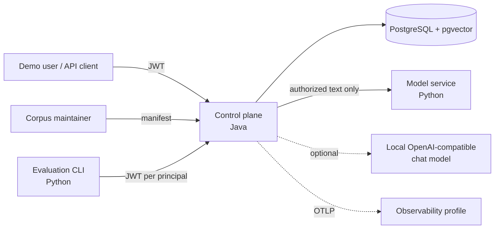

# Architecture Overview

Status: draft for v0.1. Decisions referenced as ADR-000N live in [`docs/adr/`](../adr/).

## 1. Context



Trust boundaries:

| Boundary | Crosses it | Rule |
|---|---|---|
| Client → control plane | Query, bearer token | Principal attributes come only from the verified token, never from the request body. |
| Control plane → PostgreSQL | Compiled SQL with authorization predicate | The only place candidate rows are selected. |
| Control plane → model service | Query text, authorized chunk text | The model service never receives tenant IDs, principal attributes or unauthorized text. |
| Control plane → chat model | Prompt built from authorized chunks | Document text is marked as data. The model has no tools. |

## 2. Runtime topology (Docker Compose)

| Service | Default profile | Notes |
|---|---|---|
| `postgres` | yes | `pgvector/pgvector` image, one database. |
| `control-plane` | yes | Spring Boot application. |
| `model-service` | yes | FastAPI app. Model weights are baked into the image, so it runs offline and on CPU. |
| `observability` | `--profile observability` | Single all-in-one OTLP/Grafana image, kept out of the default quickstart. |
| `chat-model` | not managed | The user points `GA_CHAT_BASE_URL` at an existing local server (e.g. Ollama). Generation is disabled when unset. |

## 3. Control-plane modules

v0.1 is one Maven module with package boundaries checked by architecture tests (ADR-0001).

```text
io.groundedaccess
├── identity        # token verification → Principal
├── authorization   # label model, policy compiler → SQL predicate, decision audit
├── corpus          # Document, DocumentVersion, Chunk, manifest ingestion, chunking
├── ingestion       # job queue, worker, idempotency
├── retrieval       # sparse, dense, RRF, RetrievalPlan, debug output
├── modelclient     # embed / rerank / chat clients, timeouts, fallback
├── answering       # context builder, prompt, structured output, citation validation
├── audit           # audit event schema and writer
├── telemetry       # span/metric conventions, redaction
└── api             # REST controllers, error model, OpenAPI
```

Dependency rules, enforced by tests:

- `authorization` depends only on `identity` types and has no Spring web dependencies.
- `retrieval` gets its predicate from `authorization`. Any query against `chunk` must go through `AuthorizedChunkQuery`, and a test checks that no other class references the chunk table.
- `answering` receives `AuthorizedCandidate` objects only. They cannot be built outside `retrieval`.
- No module other than `modelclient` knows the model-service wire format.

## 4. Data model

```sql
tenant(id, name)

document(
  id, tenant_id, external_key,            -- external_key unique per tenant, from manifest
  status,                                  -- active | disabled | deleted
  active_version_id,                       -- pointer flipped atomically on new version
  created_at, updated_at)

document_version(
  id, document_id, tenant_id, version_no,
  content_sha256,                          -- idempotency key together with labels hash
  title, source_uri,
  classification,                          -- public | internal | confidential | restricted
  allowed_departments text[],              -- empty = no department restriction
  required_projects  text[],               -- empty = no project restriction
  applies_to_regions text[],               -- scope, NOT authorization
  valid_from, valid_to,                    -- scope, NOT authorization
  labels_sha256, chunker_version, embedding_model,
  created_at)

chunk(
  id, tenant_id, document_id, version_id, ordinal,
  section_path, char_start, char_end,      -- offsets into the normalized version text
  content, content_tsv tsvector GENERATED, -- english config
  embedding vector(N),
  token_count)

ingestion_job(id, tenant_id, manifest_sha256, status, attempts,
              locked_by, locked_until, error_code, error_detail, created_at, updated_at)

query_execution(id, tenant_id, principal_id, trace_id, pipeline_config jsonb,
                policy_version, model_config jsonb, status, degraded_reasons text[],
                latency_ms jsonb, created_at)      -- no query text by default

audit_event(id, occurred_at, tenant_id, principal_id, action, resource_type,
            resource_id, decision, policy_version, trace_id, attributes jsonb)
```

Notes:

- `tenant_id` is denormalized onto `chunk` so the tenant condition can run first and can later drive partitioning.
- Access labels live on `document_version`. Changing labels creates a new version. It reuses chunk text and embeddings when `content_sha256` and `chunker_version` match, so a label change never needs a re-embed.
- Only one embedding model is active per deployment in v0.1. Switching models means a full re-index (ADR-0004).
- All timestamps are `timestamptz` and stored in UTC.

## 5. Ingestion flow

```mermaid
sequenceDiagram
    participant C as Client
    participant API as api
    participant Q as ingestion_job table
    participant W as ingestion worker
    participant MS as model service
    participant DB as PostgreSQL
    C->>API: POST /ingestion-jobs (manifest)
    API->>Q: insert job (manifest_sha256 unique per tenant → idempotent)
    API-->>C: 202 {jobId}
    W->>Q: SELECT … FOR UPDATE SKIP LOCKED
    loop each document in manifest
        W->>W: parse + normalize + chunk (structure-aware, token cap)
        alt content + labels unchanged
            W->>W: skip (no new version)
        else changed
            W->>MS: embed(chunk texts) unless cached
            W->>DB: tx: insert version + chunks; update document.active_version_id
        end
    end
    W->>Q: status = succeeded | failed(error_code)
```

- **Atomic version switch:** each document gets its own transaction that inserts the new version's chunks and flips `active_version_id`. Queries join on `active_version_id`, so readers see either the old version or the new one, never a mix.
- **Disable/delete** is a status update that takes effect on the next query. Rows of old versions and deleted documents are removed later by a background cleanup job.
- **Retries:** bounded, with exponential backoff. A job that runs out of attempts is marked `failed` with an `error_code`. That is the dead-letter state; there is no separate queue.
- **Chunking:** split on Markdown headings first, then on paragraphs, with a token cap and a small overlap. Plain text splits on paragraphs only. The chunker has a version number, and eval results record it.
- **Precomputed embeddings:** the demo corpus ships an embeddings file keyed by `(chunk content hash, chunker_version, embedding model@revision)`. On a match the worker skips the model call. This makes CI and the quickstart fast and deterministic.

## 6. Query flow

```mermaid
sequenceDiagram
    participant C as Client
    participant API as api
    participant AZ as authorization
    participant R as retrieval
    participant DB as PostgreSQL
    participant MS as model service
    participant A as answering
    participant L as chat model
    C->>API: POST /query {query, asOf?, plan?}
    API->>AZ: principal from verified JWT
    AZ-->>R: compiled predicate + policy_version
    par sparse
        R->>DB: FTS with predicate, top k_s
    and dense
        R->>MS: embed(query)
        R->>DB: vector search with predicate, top k_d
    end
    R->>R: RRF fuse, dedupe overlapping chunks
    opt rerank enabled
        R->>MS: rerank(query, top N authorized texts)
    end
    R-->>A: AuthorizedCandidate list
    A->>A: build context within token budget, assign S1..Sn
    opt generation configured
        A->>L: prompt (evidence as data), structured output
        A->>A: validate citations ⊆ {S1..Sn}; map to chunk ids
    end
    API->>DB: insert query_execution + audit_event
    API-->>C: answer | abstention, citations, traceId
```

Response rules:

- A query about content the principal is not allowed to see gets the **same response shape** as a query the corpus cannot answer: `status: "no_answer"`. No filtered counts and no document titles go in the response. See [authorization.md](authorization.md#existence-leakage).
- Without a configured chat model, `/query` returns ranked evidence (`status: "evidence_only"`).

## 7. Failure behaviour

| Failure | Behaviour | Marked as |
|---|---|---|
| Model service unavailable at query time (embed) | Sparse-only retrieval | `degraded: dense_unavailable` |
| Reranker timeout/error | Fused RRF order | `degraded: rerank_unavailable` |
| Chat model timeout/error | Evidence-only response | `degraded: generation_unavailable` |
| Chat output fails schema or cites unknown IDs | Invalid statements dropped. If none remain, abstention. | `citation_rejected` count |
| Audit write fails | Query fails closed with 503 | error metric |
| Model service unavailable during ingestion | Job retried, then `failed` | job `error_code` |

Evaluation runs treat any degraded query as invalid for that configuration (see evaluation strategy).

All outbound calls have explicit timeouts. Retries are only used for idempotent calls (embed, rerank) and are capped at one retry on the query path.

## 8. API surface (v0.1)

```text
POST   /api/v1/ingestion-jobs                 # manifest ingestion, async
GET    /api/v1/ingestion-jobs/{jobId}
GET    /api/v1/documents/{documentId}         # authorized metadata only; 404 if not visible
DELETE /api/v1/documents/{documentId}         # admin scope
POST   /api/v1/retrieval/search               # ranked candidates + debug fields
POST   /api/v1/query                          # answer / evidence / abstention
GET    /api/v1/query-executions/{id}          # own executions only
```

- Admin endpoints (ingestion, delete) need an `admin` scope in the token. Query endpoints need `query`.
- `/retrieval/search` returns per-candidate channel ranks and scores and the serialized `RetrievalPlan`. The debug fields need a `debug` scope. The eval tokens carry it and ordinary demo users do not.
- A document that is not visible returns 404, never 403.
- Evaluation runs are **not** an API resource. The Python CLI owns them (see evaluation strategy).
- OpenAPI lives in `packages/contracts/` and is checked for compatibility in CI.

## 9. Observability

Span tree per query:

```text
query.request
├── auth.verify
├── policy.compile
├── retrieval.sparse
├── retrieval.dense         (includes model.embed child span)
├── retrieval.fusion
├── rerank                  (model.rerank child span)
├── context.build
├── generation
└── citation.validate
```

Allowed span attributes: `pipeline.config_hash`, `policy.version`, `retrieval.k`, candidate counts per channel *after* authorization, `model.name`, `model.revision`, token counts, `degraded` reasons, error codes.

Never recorded by default: query text, chunk text, prompts, model output, embeddings, document titles, principal attributes other than an opaque principal ID, and counts of rows removed by authorization.

The audit log is a separate record. Audit events are never sampled and follow a stable, versioned schema.
