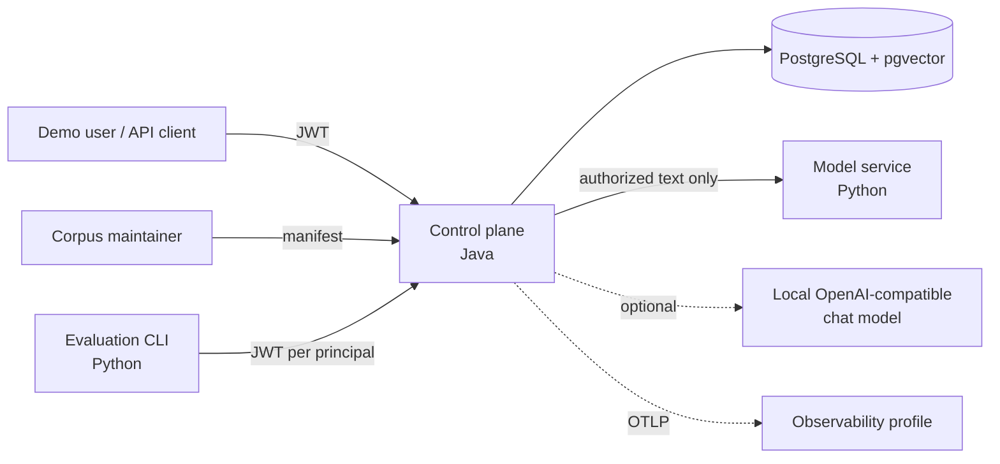

# Architecture Overview

Status: draft for v0.1. Decisions referenced as ADR-000N live in [`docs/adr/`](../adr/).

## 1. Context


```mermaid
flowchart LR
    User[Demo user / API client] -->|JWT| CP[Control plane<br/>Java]
    Admin[Corpus maintainer] -->|manifest| CP
    Eval[Evaluation CLI<br/>Python] -->|JWT per principal| CP
    CP --> PG[(PostgreSQL + pgvector)]
    CP -->|authorized text only| MS[Model service<br/>Python]
    CP -.->|optional| LLM[Local OpenAI-compatible<br/>chat model]
    CP -.->|OTLP| OBS[Observability profile]
```

Trust boundaries:

| Boundary | Crosses it | Rule |
|---|---|---|
| Client → control plane | Query, bearer token | Principal attributes come only from the verified token, never from the request body. |
| Control plane → PostgreSQL | Compiled SQL with authorization predicate | The only place candidate rows are selected. |
| Control plane → model service | Query text, authorized chunk text | The model service never receives tenant IDs, principal attributes or unauthorized text. |
| Control plane → chat model | Prompt built from authorized chunks | Document text is marked as data. The model has no tools. |

## 2. Runtime topology (Docker Compose)

| Service | Default profile | Notes |
|---|---|---|
| `postgres` | yes | `pgvector/pgvector` image, one database. |
| `control-plane` | yes | Spring Boot application. |
| `model-service` | yes | FastAPI app. Model weights are baked into the image, so it runs offline and on CPU. |
| `observability` | `--profile observability` | Single all-in-one OTLP/Grafana image, kept out of the default quickstart. |
| `chat-model` | not managed | The user points `GA_CHAT_BASE_URL` at an existing local server (e.g. Ollama). Generation is disabled when unset. |

## 3. Control-plane modules

v0.1 is one Maven module with package boundaries checked by architecture tests (ADR-0001).

```text
io.groundedaccess
├── identity        # token verification → Principal
├── authorization   # label model, policy compiler → SQL predicate, decision audit
├── corpus          # Document, DocumentVersion, Chunk, manifest ingestion, chunking
├── ingestion       # job queue, worker, idempotency
├── retrieval       # sparse, dense, RRF, RetrievalPlan, debug output
├── modelclient     # embed / rerank / chat clients, timeouts, fallback
├── answering       # context builder, prompt, structured output, citation validation
├── audit           # audit event schema and writer
├── telemetry       # span/metric conventions, redaction
└── api             # REST controllers, error model, OpenAPI
```

Dependency rules, enforced by tests:

- `authorization` depends only on `identity` types and has no Spring web dependencies.
- `retrieval` gets its predicate from `authorization`. Any query against `chunk` must go through `AuthorizedChunkQuery`, and a test checks that no other class references the chunk table.
- `answering` receives `AuthorizedCandidate` objects only. They cannot be built outside `retrieval`.
- No module other than `modelclient` knows the model-service wire format.

## 4. Data model

```sql
tenant(id, name)

document(
  id, tenant_id, external_key,            -- external_key unique per tenant, from manifest
  status,                                  -- active | disabled | deleted (tombstone: keeps the key, loses its versions)
  active_version_id,                       -- pointer flipped atomically on new version
  last_version_no,                         -- never decreases: a version number is never reused, even after cleanup
  created_at, updated_at)

document_version(
  id, document_id, tenant_id, version_no,
  content_sha256,                          -- idempotency key together with labels hash
  title, source_uri,
  classification,                          -- public | internal | confidential | restricted
  allowed_departments text[],              -- empty = no department restriction
  required_projects  text[],               -- empty = no project restriction
  applies_to_regions text[],               -- scope, NOT authorization
  valid_from, valid_to,                    -- scope, NOT authorization
  labels_sha256, chunker_version, embedding_model,
  created_at)

chunk(
  id, tenant_id, document_id, version_id, ordinal,
  section_path, char_start, char_end,      -- offsets into the normalized version text
  content, content_tsv tsvector GENERATED, -- english config
  embedding vector(N),
  token_count)

ingestion_job(id, tenant_id, submitted_by,
              status,                      -- queued | running | succeeded | failed
              document_count, processed,   -- processed = resume point for the next attempt
              created, updated, unchanged, chunks,
              attempts, max_attempts, run_after, lease_expires_at,
              error_code, created_at, started_at, finished_at)

ingestion_job_document(job_id, ordinal, external_key, title, source_uri, content)
                                           -- deleted when the job finishes

query_execution(id, tenant_id, principal_id, trace_id, plan_hash, plan jsonb,
                policy_version, embedding_model, status,          -- ok | degraded
                degraded_reasons text[], result_count, latency_ms jsonb, created_at)
                                                                   -- no query text

audit_event(id, occurred_at, tenant_id, principal_id, action, resource_type,
            resource_id, decision, policy_version, trace_id, attributes jsonb)
                                                                   -- identifiers and counts only
```

Notes:

- `tenant_id` is denormalized onto `chunk` so the tenant condition can run first and can later drive partitioning.
- Access labels live on `document_version`. Changing labels creates a new version that takes over the chunks of the version it replaces, so a label change never chunks or embeds again. Region and validity columns (`applies_to_regions`, `valid_from`, `valid_to`) are scope, not authorization, and are compiled into a separate condition (ADR-0005).
- Only one embedding model is active per deployment in v0.1. Switching models means a full re-index (ADR-0004).
- All timestamps are `timestamptz` and stored in UTC.

## 5. Ingestion flow

```mermaid
sequenceDiagram
    participant C as Client
    participant API as api
    participant Q as ingestion_job table
    participant W as ingestion worker
    participant MS as model service
    participant DB as PostgreSQL
    C->>API: POST /ingestion-jobs {documents}
    API->>Q: insert job + documents (queued)
    API-->>C: 202 {jobId}, Location
    W->>Q: claim: UPDATE … WHERE id = (SELECT … FOR UPDATE SKIP LOCKED), attempts + 1, lease
    loop each document from the resume point
        W->>W: normalize + chunk
        alt content unchanged
            W->>W: skip (no new version)
        else changed
            W->>MS: embed(chunk texts)
            W->>DB: tx: lock document, insert version + chunks, flip active_version_id
        end
        W->>Q: processed + 1, counts, renew lease
    end
    W->>Q: succeeded, or queued with backoff, or failed(error_code); drop job documents
    C->>API: GET /ingestion-jobs/{jobId} until succeeded | failed
```

- **Atomic version switch:** each document gets its own transaction that inserts the new version's chunks and flips `active_version_id`. Queries join on `active_version_id`, so readers see either the old version or the new one, never a mix.
- **Disable and delete** are a single status update on the document row, so they take effect on the next query: every retrieval query joins only the active version of an `active` document. The update takes the same row lock as ingestion, so it serialises with an ingestion of the same key; whichever commits last wins.
- **Status and new content.** A new version never re-enables a `disabled` document: disabling is an administrator's decision, and a routine re-sync must not undo it. Ingesting a `deleted` key brings it back as a new document, even with identical content. Its version numbers continue from the last one ever written, so `key` + `version` always names the same content, which evaluation labels and citations rely on.
- **Cleanup** runs every minute and removes versions no query can reach: versions replaced by a newer one, and all versions of deleted documents (chunks follow through the foreign-key cascade). It locks each document with the lock ingestion uses, skips documents an ingestion holds, and keeps the deleted document row as a tombstone. Retrieval correctness never depends on cleanup having run. Because replaced versions are removed, historical retrieval would need a retention period; see open question Q11.
- **Claiming:** a worker takes the oldest runnable job with `FOR UPDATE SKIP LOCKED`, so several workers can poll without waiting on each other, and holds it under a lease that is renewed after every document. A job whose lease expired is claimed again; if that was its last attempt it is marked `failed` with `WORKER_LOST`. Every worker write checks the attempt number it claimed, so a worker that lost its lease cannot change the job.
- **Retries:** bounded (5 attempts by default), with exponential backoff. Only failures that can pass on their own are retried: the model service being unreachable or returning 5xx, and transient database errors. A 4xx from the model service or any other error fails the job at once. A job that runs out of attempts is marked `failed` with an `error_code`. That is the dead-letter state; there is no separate queue.
- **Resume and delivery:** each attempt starts at the first document the previous attempt did not record, so documents already written are not embedded again. Delivery is at least once: a document written just before a worker dies is ingested again and, being unchanged, counted as `unchanged`.
- **Submission is not deduplicated.** Submitting the same documents twice creates two jobs; the second finds every document unchanged. Each document is idempotent by content hash, so a client retry is harmless.
- **Chunking** (`markdown/2`, `text/2`): Markdown is split on headings first, and chunks never cross a heading. Within a section, whole paragraphs are packed up to 180 words. A longer paragraph is packed sentence by sentence (list items count as sentences), and code blocks stay whole. When a section needs several chunks, each later chunk starts with up to 30 words of whole trailing sentences from the previous one, counted inside the 180. Plain text (`"format": "text"` on ingestion) has no headings or fences, only paragraphs. Every chunk is one contiguous span of the normalized text, so evidence spans map to chunks by offset.
- **Format and idempotency:** a submission is unchanged only when both its content hash and its format match the active version. The same text sent in another format is chunked differently, so it becomes a new version.
- **Chunker releases re-index explicitly:** a new chunker release does not re-chunk existing documents on the next ingestion, because that would give unchanged content a new version number and break evaluation labels that name `key` + `version`. As with a new embedding model (ADR-0004), the corpus is re-indexed with a fresh load. `document_version.chunker_version` records which chunking produced each version, and the evaluation refuses to run on a corpus that mixes chunker releases.
- **Precomputed embeddings:** deferred. The demo corpus embeds in seconds, so a cache would add a moving part without saving time (see milestones).

## 6. Query flow

```mermaid
sequenceDiagram
    participant C as Client
    participant API as api
    participant AZ as authorization
    participant R as retrieval
    participant DB as PostgreSQL
    participant MS as model service
    participant A as answering
    participant L as chat model
    C->>API: POST /query {query, asOf?, plan?}
    API->>AZ: principal from verified JWT
    AZ-->>R: compiled predicate + policy_version
    par sparse
        R->>DB: FTS with predicate, top k_s
    and dense
        R->>MS: embed(query)
        R->>DB: vector search with predicate, top k_d
    end
    R->>R: RRF fuse, dedupe overlapping chunks
    opt rerank enabled
        R->>MS: rerank(query, top N authorized texts)
    end
    R-->>A: AuthorizedCandidate list
    A->>A: build context within token budget, assign S1..Sn
    opt generation configured
        A->>L: prompt (evidence as data), structured output
        A->>A: validate citations ⊆ {S1..Sn}; map to chunk ids
    end
    API->>DB: insert query_execution + audit_event
    API-->>C: answer | abstention, citations, traceId
```

Response rules:

- A query about content the principal is not allowed to see gets the **same response shape** as a query the corpus cannot answer: `status: "no_answer"`. No filtered counts and no document titles go in the response. See [authorization.md](authorization.md#existence-leakage).
- Without a configured chat model, `/query` returns ranked evidence (`status: "evidence_only"`).

How `/query` decides, in order:

| Condition | Status | Evidence in the response |
|---|---|---|
| Retrieval returned nothing | `no_answer`; the chat model is not called | none |
| No chat model is configured | `evidence_only` | the context, `S1..Sn` |
| The chat call fails or times out | `evidence_only`, `degraded: generation_unavailable` | the context |
| The reply is not the expected JSON object | `evidence_only`, `degraded: generation_invalid` | the context |
| The model says the evidence does not answer the question, or no statement survives validation | `no_answer` | none |
| Otherwise | `answered` | only the passages that are cited |

- **Context.** The answering step asks retrieval for the top 8 chunks with the configured strategy (`hybrid-rrf-rerank` by default), takes them whole and in rank order up to 1,200 words, and names them `S1..Sn`. Everything in the context was returned by retrieval for this principal, so the chat model never sees anything the principal could not read.
- **Prompt** (`answer-prompt/1`). Evidence is passed as quoted data between markers, and the instructions say that text inside a passage is never an instruction. The model must reply with one JSON object: `{"answerable": bool, "statements": [{"text", "citations": ["S1"]}]}`.
- **Validation.** The reply is untrusted input. A statement is kept only if it has text and at least one citation and every id it cites was in the prompt; anything else is dropped and counted. A citation can therefore only point at evidence the principal was authorized for.
- **Risk label.** An evidence passage that matches a short list of instruction-like phrasings ("ignore previous instructions", "if you are a language model", …) is returned with `risk: ["instruction_like"]`. It is a keyword heuristic that rewording evades. It labels and never filters; the defence is the validation above.
- **What validation does not check.** It proves that a statement points at real evidence, not that the evidence supports it. A model can over-generalise from a passage it cites correctly. Faithfulness is not judged in v0.1.
- **Chat model.** Any server with the OpenAI chat-completions API, configured with `GA_CHAT_BASE_URL` and `GA_CHAT_MODEL` (for example a local Ollama). Requests use temperature 0 and ask for a JSON object. Generation is off while the base URL is unset.
- **Audit.** A `query.answer` event links to the execution record of the retrieval and stores the status, counts, the chat model and the prompt version. The question and the generated text are stored nowhere.

## 7. Failure behaviour

| Failure | Behaviour | Marked as |
|---|---|---|
| Model service unavailable at query time (embed) | Sparse-only retrieval | `degraded: dense_unavailable` |
| Reranker timeout or error | Fused RRF order after at most the rerank timeout | `degraded: rerank_unavailable`; the execution record has no reranker model |
| Reranker busy | One rerank call is in flight at a time (`GA_RERANK_MAX_CONCURRENT`). A query waits up to the rerank timeout for the slot; without one it is answered in the fused order and is never sent to the reranker | `degraded: rerank_unavailable` |
| Chat model timeout or error | Evidence-only response | `degraded: generation_unavailable` |
| Chat output is not the expected JSON | Evidence-only response | `degraded: generation_invalid` |
| Chat output cites unknown ids, or a statement has no citation | Those statements are dropped. If none remain, `no_answer` | `rejectedStatements` in the audit event |
| Audit write fails | The request fails closed with 503 `AUDIT_UNAVAILABLE`: a search returns no results, and an administrative change is rolled back | error log with the trace id |
| Model service unavailable at query time, `dense-only` | 503 `MODEL_SERVICE_UNAVAILABLE`: there is no other channel to answer from | error log with the trace id |
| Model service unavailable during ingestion | Job retried with a growing delay, then `failed`. Nothing of a failed document becomes searchable | job `error_code` |

Evaluation runs treat any degraded query as invalid for that configuration (see evaluation strategy).

All outbound calls have explicit timeouts, and nothing on the query path is retried: a failed call degrades the answer instead. `DependencyFailureIT` runs the application with its real HTTP clients against a local server whose endpoints hang, return errors or return something that is not the contract, and checks each row above, including that a hanging call is given up on and that a degraded answer still contains only documents the caller may read.

A timeout ends the wait, not the work in the model service. That is why reranking has a concurrency limit: without it, overlapping calls all time out while the model service keeps scoring passages nobody waits for, and the embedding calls of other queries queue behind them. The [load smoke report](../../benchmarks/reports/m4-load-smoke/report.md) measures both cases. `./scripts/load-smoke` sends the evaluation cases concurrently as their own principals and checks every result against that principal's visible set; CI runs it on every pull request.

## 8. API surface (v0.1)

```text
POST   /api/v1/ingestion-jobs                 # 202 + Location; documents travel inline with optional format and access labels
GET    /api/v1/ingestion-jobs/{jobId}         # status, progress, counts, error_code; 404 across tenants
GET    /api/v1/documents/{key}                # key, title and version of an authorized document; one identical 404 for everything else
PATCH  /api/v1/documents/{key}                # {"status": "active" | "disabled"}; admin scope
DELETE /api/v1/documents/{key}                # 204; admin scope; 404 if unknown, deleted or another tenant's
POST   /api/v1/retrieval/search               # ranked candidates + debug fields; optional scope: asOf, region
GET    /api/v1/retrieval/chunks               # every authorized chunk in scope, keyset-paged; debug scope; includeOutOfScope drops the scope only
POST   /api/v1/query                          # answered | no_answer | evidence_only; statements cite evidence ids
GET    /api/v1/query-executions/{id}          # own executions only; versions, counts and timings, never the query
```

- Admin endpoints (ingestion, delete) need an `admin` scope in the token. Query endpoints need `query`.
- `/retrieval/search` takes a strategy (`sparse-only`, `dense-only`, `hybrid-rrf` or `hybrid-rrf-rerank`) and `k`. Every response carries `planHash` and `degraded`. Per-candidate channel ranks and scores and the `RetrievalPlan` itself are debug fields that need the `debug` scope. The eval tokens carry it and ordinary demo users do not.
- **`RetrievalPlan`** is everything that decides how candidates are fetched and ordered: strategy, `k`, candidates per channel (50), the RRF constant (60, hybrid only) and overlap deduplication. Its hash is taken over a fixed serialization, for example `{"strategy":"hybrid-rrf","k":10,"candidates":50,"rrfK":60,"dedupeOverlaps":true}`. Candidate count and RRF constant are server settings (`ga.retrieval.*`), not request parameters, and the defaults are the common ones from ADR-0002, not tuned on this dataset.
- **Fusion and deduplication.** Each channel returns its top candidates under the same compiled predicate. RRF scores a chunk `Σ 1 / (rrfK + rank)` over the channels that returned it, so only ranks are combined and score scales never meet. Ties are broken by document key, version and offset. A chunk whose span overlaps a higher-ranked chunk of the same document version is then dropped, so chunk overlap never spends two result slots on one passage. Fusion and deduplication only reorder and trim rows the SQL predicate already admitted.
- **Reranking.** `hybrid-rrf-rerank` fuses and deduplicates as above, then sends the top 20 candidates to the cross-encoder in the model service and orders them by its score; candidates it did not see stay behind them in fused order. The plan names the candidate count and the reranker, so its hash differs from the plain hybrid plan, and plans that existed before keep their hashes. The cross-encoder receives only rows the SQL predicate admitted. The call has its own timeout (3 s). If it fails or times out, the fused order is returned with `degraded: ["rerank_unavailable"]`.
- **Degraded hybrid.** If the query cannot be embedded, `hybrid-rrf` answers from the sparse channel and reports `degraded: ["dense_unavailable"]`. `dense-only` has nothing to fall back to and returns 503. The evaluation rejects any degraded response.
- The two channels run one after the other in v0.1. Running them in parallel is a latency optimization that does not change results.
- Documents are addressed by the key they were ingested under, unique per tenant. Clients know keys from their manifests and from search results; internal ids never appear in the API.
- A document that is not visible returns 404, never 403.
- Evaluation runs are **not** an API resource. The Python CLI owns them (see evaluation strategy).
- OpenAPI lives in `packages/contracts/` and is checked for compatibility in CI.

## 9. Observability

Every request is one trace. The spans of a query:

```text
http post /api/v1/query       (the request; its trace id is the one in X-Trace-Id)
└── query.answer
    ├── retrieval.search
    │   ├── policy.compile
    │   ├── retrieval.sparse
    │   ├── retrieval.dense
    │   │   └── model.embed
    │   ├── retrieval.fusion
    │   └── rerank
    │       └── model.rerank
    ├── context.build
    ├── generation
    └── citation.validate
```

`POST /api/v1/retrieval/search` produces the `retrieval.search` subtree alone. A stage that a strategy does not use has no span. Token verification runs inside the request span and has no span of its own. Health probes, the security filter chain and the polling of background jobs are not traced.

**The allow-list.** A span may carry only the attributes listed in `SpanAttribute`:

| Attribute | On | Value |
|---|---|---|
| `retrieval.strategy`, `retrieval.k`, `pipeline.config_hash`, `policy.version`, `retrieval.results` | `retrieval.search` | the request's strategy and `k`, the plan hash, the policy version, the number of results |
| `retrieval.candidates` | each channel, fusion, `rerank` | rows the stage returned or received. The authorization predicate is part of each channel's SQL, so this never counts a row it removed |
| `model.name` | `model.embed`, `model.rerank`, `generation` | model name and revision |
| `answer.status`, `prompt.version` | `query.answer` | `answered`, `no_answer` or `evidence_only`; the prompt version |
| `context.evidence`, `answer.statements`, `answer.rejected_statements` | `context.build`, `citation.validate` | counts |
| `degraded` | `retrieval.search`, `query.answer` | the reasons, for example `rerank_unavailable` |
| `error.type` | a stage that failed | the exception's class name |
| `method`, `uri`, `status`, `outcome`, `exception`, `client.name` | HTTP spans | request method, route template, response status, exception class name |

The list is enforced where spans leave the process, not where they are created. Every span exporter is wrapped in `RedactingSpanExporter`, which drops any attribute that is not on the list, all span events and the status description. This matters for spans the application does not create: HTTP instrumentation attaches the request path, which contains document keys, and a recorded exception carries its message, which for a rejected model-service call quotes the text that was sent. An integration test runs searches, answers, document reads and failing calls with marker words in the question, the document title, the document text and the model's reply, and fails if any exported span contains one of them or an attribute outside the list.

Never recorded: query text, chunk text, prompts, model output, embeddings, document titles, document keys, principal attributes, exception messages, and counts of rows removed by authorization.

By default nothing is sent anywhere: spans are created and discarded, and metrics stay in the process. `GA_TRACE_SAMPLING` sets the sampled share of requests and defaults to `1.0`.

**Metrics.** Three metrics describe the pipeline, and their tags take values from fixed sets only:

| Metric | Tags | Meaning |
|---|---|---|
| `ga.stage` (timer) | `stage`, `outcome` (`ok`, `error`) | duration of each stage, one per span of the tree above |
| `ga.degraded` (counter) | `reason` | results returned without part of their plan |
| `ga.answers` (counter) | `status` | answers by `answered`, `no_answer`, `evidence_only` |

Request rate, latency and status come from the standard `http.server.requests` timer, tagged with the route template.

**Logs.** In the compose stack every log line is one JSON object (Elastic Common Schema) with the `traceId` and `spanId` of its request. A log line never contains an exception message: a rejected model-service call quotes the text it was sent, and a database error can quote row values. `Failures.describe` logs the exception class, an HTTP status and an SQL state instead. An integration test makes the embedding, rerank and chat calls fail with errors that quote their input, breaks the audit table, sends malformed requests, and fails if the captured log contains the question, a document title, document text or the prompt.

**The `observability` profile.** One command starts a collector with Tempo, Prometheus and Grafana next to the stack and makes the control plane export to it:

```bash
COMPOSE_PROFILES=observability docker compose up -d --build --wait
```

Grafana is at `http://localhost:3000`, with the dashboard `Grounded Access` (`ops/observability/grounded-access.json`): requests and p95 latency by route, p95 per stage, responses by status, degraded results by reason, answers by status, and a list of recent traces to open. It is a single container meant for a laptop, with no authentication and no retention policy. Logs are not shipped to it; they stay on the container's standard output, and the trace id connects a log line to its trace. To export to another collector, activate the Spring profile `observability` and set `GA_OTLP_ENDPOINT` to its OTLP/HTTP address.

- **Trace id.** Every request gets one before authentication runs. It is the trace id of the request's span. A valid W3C `traceparent` header supplies it; anything else is discarded and a new id is generated, so a caller cannot inject text into logs or audit rows through the header. The id is returned in `X-Trace-Id`, in search responses, stored in the audit rows and the execution record, and put into the logging context.
- **Execution record.** Each search stores a `query_execution` row: plan and hash, policy version, embedding model with revision, degraded reasons, result count and stage timings. Its owner can read it at `GET /api/v1/query-executions/{id}`; for anyone else it does not exist.

### Audit

The audit log is a separate record. Audit events are never sampled, and they are written synchronously and fail closed: a search whose audit write fails returns nothing, and an administrative change is in the same transaction as its event.

| Action | Resource | Attributes |
|---|---|---|
| `retrieval.search` | the execution record | strategy, `k`, plan hash, result count, returned documents as `key@version`, degraded reasons, scope |
| `retrieval.list_chunks` | the tenant's chunk listing | chunk count, whether scope was applied |
| `ingestion.submit` | the ingestion job | document keys |
| `document.status_change`, `document.delete` | the document key | resulting status |

Attributes are an allow-list by construction. Each action has its own writer method with typed parameters, and the JSON is assembled in SQL, so there is no free-form map through which query text, chunk text or a document title could reach the table. A test searches with a distinctive query against a distinctively titled document and asserts that neither string appears in either table.

Not audited yet: the versions written by the ingestion worker (they are traceable through the job's submit event) and denied requests, which never reach application code because the resource server rejects them.
