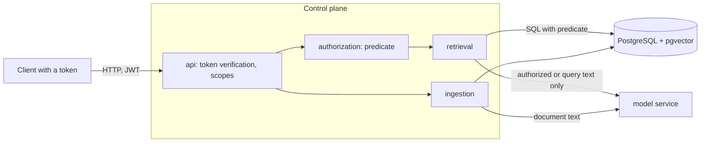

# Threat Model

Status: v0.1 pre-release. This document describes the system as it is on `main`, including what it does not defend against. Grounded Access is a reference system and has not been hardened for production.

Each control below names the test or check that verifies it. A control without a check is listed as a residual risk, not as a control.

## 1. What is protected

| Asset | Why it matters |
|---|---|
| Document content: chunk text, titles, embeddings | The purpose of the system is that a principal reads only what the access labels allow |
| The existence of a document | Knowing that "Compensation Bands" exists is itself information |
| Access labels and document status | Whoever can change them decides who reads what |
| Audit events and execution records | They are the evidence of who retrieved what and who changed what |
| Query text | Questions reveal what a person is working on |

## 2. Actors

| Actor | Can do | Trusted to |
|---|---|---|
| Query user | Search and read documents with a token carrying the `query` scope | Nothing beyond their token |
| Evaluation user | The same, plus the `debug` scope: scores, plans and a listing of every chunk they are authorized for | Not to publish the listing |
| Tenant administrator | Ingest, relabel, disable and delete documents of their own tenant with the `admin` scope | Label documents correctly for their tenant |
| Operator | Run the stack; has database and host access | Everything; outside the model |
| Outsider | Reach the HTTP API without a valid token | Nothing |

There is no role between query user and tenant administrator. Anyone who can ingest can also relabel any document of that tenant.

## 3. Trust boundaries

- **Client to control plane.** Every principal attribute comes from the verified token. Request bodies and query parameters can set scope (`asOf`, `region`), never identity or authorization.
- **Control plane to PostgreSQL.** The authorization decision is made inside the query. The application connects with one database role; PostgreSQL row-level security is not used.
- **Control plane to model service.** The model service has no identities and no database access. It receives query text and document text and returns vectors. The connection is unauthenticated HTTP inside the compose network.

## 4. Abuse cases

### Reading what one may not read

| # | Threat | Control | Verified by |
|---|---|---|---|
| A1 | Retrieve another tenant's content | The tenant condition is part of the predicate that every chunk query embeds | Property test against a reference evaluator on the listing, sparse and dense paths; integration tests; evaluation gate with 7 cross-tenant cases |
| A2 | Retrieve content above one's clearance, or of another department or project | Clearance, department and project rules in the same predicate; a missing or unknown attribute grants the least access | The same property test; integration tests per rule; 23 same-tenant negatives in the evaluation gate |
| A3 | Smuggle SQL or array syntax through a claim value | The predicate text is constant; claim values are bound parameters; array elements are quoted | Property test with hostile values; integration test with injection strings |
| A4 | Reach unauthorized rows through a code path that forgets the predicate | Only `AuthorizedChunkQuery` may read the chunk table | Architecture test over the main sources |
| A5 | Use fusion, deduplication or a later stage to surface filtered rows | Those stages only reorder and trim rows the SQL already admitted | By construction; the gate checks every returned chunk |
| A6 | Use `asOf` to read an older, less restricted version | `asOf` filters the current version only; replaced versions are never candidates (ADR-0005) | Integration test; the gate treats a chunk of a replaced version as a violation |
| A7 | Use scope parameters to widen access | Scope is a separate condition; dropping it (`includeOutOfScope`) keeps the predicate | Property test: without scope, exactly the authorized set |
| A8 | Keep reading after access is revoked by a label change or deletion | A label change, a disable and a delete apply to the next query | Integration tests, including a label change while the model service is down |

### Learning that something exists

| # | Threat | Control | Verified by |
|---|---|---|---|
| E1 | Probe document keys to learn which exist | Reading an unauthorized, disabled, deleted, foreign or unknown key gives one identical 404 | Integration test comparing status, body and header names |
| E2 | Infer hidden documents from search responses | No counts of filtered rows; a keyword search that only hidden documents could answer equals one nothing answers | Integration test |
| E3 | Probe job or execution ids of other principals | Records outside the caller's tenant, or of another principal, answer 404 | Integration tests |
| E4 | Time the difference between "hidden" and "missing" | None | **Residual risk R1** |

### Changing what others read

| # | Threat | Control | Verified by |
|---|---|---|---|
| P1 | An administrator of one tenant changes another tenant's documents | The tenant comes from the token; a foreign key answers 404 | Integration tests |
| P2 | A query user changes or ingests documents | The `admin` scope is required | Integration tests |
| P3 | An ingester lowers a document's classification, or replaces its content with false statements | None beyond the `admin` scope. Submissions and status changes are audited with the acting principal | **Residual risk R2** |
| P4 | A document carries text written to steer a language model ("ignore previous instructions") | Evidence is passed as quoted data with an instruction that nothing inside it is a command; the reply must be a JSON object, and a statement survives only if every citation names evidence that was in the prompt. An injected instruction therefore cannot add evidence or cite a document the principal may not read. It can still change what a statement says: in the committed local run, 2 of 5 injection cases added the planted statement to the answer | Tests for the validation; `ga-eval answers` counts steered cases. Otherwise **Residual risk R3** |
| P5 | A document is stuffed with keywords to rank first | Its reach is limited to the principals its labels admit; ranking is otherwise untouched | Not defended; a relevance problem inside the authorized audience |

### Leaking through the side

| # | Threat | Control | Verified by |
|---|---|---|---|
| S1 | Query text, chunk text or titles end up in audit rows | Audit attributes are an allow-list of typed parameters assembled in SQL | Integration test that reads every audit and execution row |
| S2 | A caller injects text into logs or audit rows through the trace header | Only a well-formed W3C trace id is accepted; anything else is replaced | Unit test |
| S3 | The debug listing is used to copy everything a principal may read | It needs the `debug` scope, runs under the predicate and is audited per page | Integration tests. Bulk reading of what one is authorized for is not prevented |
| S4 | The model service leaks or retains text | It holds no identities and has no database access; it is part of the trusted deployment | Architecture test for the client boundary. Otherwise **R4** |
| S5 | Sensitive text appears in application logs | Log statements written by the project carry ids, codes and counts. Exception messages from dependencies are logged as they are, and no automated check covers every log line | **Residual risk R5** |

### Evading accountability and availability

| # | Threat | Control | Verified by |
|---|---|---|---|
| V1 | Act while the audit store is unavailable | Audit is synchronous and fails closed: no results, and administrative changes roll back | Integration tests |
| V2 | Alter or delete audit rows | None inside the application's reach | **Residual risk R6** |
| V3 | Exhaust the service with large ingestion bodies or many queries | Request size limits per document and per batch; no rate limiting; exact vector search is linear in the authorized corpus | **Residual risk R7** |

## 5. Residual risks

| # | Risk | Why it is accepted in v0.1 | What would close it |
|---|---|---|---|
| R0 | **Identity is a demo.** Tokens are signed with a key that is published in the repository, so anyone can mint any identity. Tokens cannot be revoked before they expire | The project demonstrates authorization given a verified principal, not identity management | OIDC against a real identity provider, short token lifetimes, key rotation |
| R1 | Timing differences between an authorized hit, a hidden document and a missing one | Constant-time responses would need padding or batching and have not been measured | Measure first; then uniform response paths |
| R2 | One administrative role per tenant: whoever may ingest may also declassify. Replaced versions are deleted within a minute, so the previous content is not kept for review | Roles and review flows are outside the scope of v0.1 | Separate author and labeller roles, approval for label changes, version retention |
| R3 | Generated answers can be wrong while carrying valid citations. Measured with `llama3:8b`: 2 of 5 planted instructions added a false statement, and 10 of 24 questions that should have been refused were answered from a readable look-alike document. Nothing verifies that a statement is supported by the passage it cites | Faithfulness judging is out of scope for v0.1. No hidden content leaked in that run | An entailment check between each statement and its cited passage; prompt work on the `dev` split; a larger injection suite |
| R4 | The model service is unauthenticated inside the deployment network and sees every ingested text | It runs in the same trust zone as the control plane | Mutual TLS or a service token; network policy |
| R5 | No automated guarantee that application logs never contain sensitive text | The audit path is tested; general logging is reviewed by hand | A log-capturing test in the failure-test suite (M4) |
| R6 | Audit rows are ordinary table rows. A database administrator can change them, and nothing would show it | Tamper evidence needs infrastructure the demo does not have | Append-only storage or hash chaining; shipping events off the database |
| R7 | No rate limiting; exact vector search scales with the authorized corpus | Demo scale | Rate limits at the edge; an approximate index, measured for filtered recall first (ADR-0002) |
| R8 | The predicate is enforced by the application, not by the database. Anyone with the application's database credentials reads everything | Defence in depth is deferred | PostgreSQL row-level security as a second layer; separate roles for ingestion and retrieval |
| R9 | Embeddings of every chunk are stored next to the text | They are never returned by the API and sit behind the same predicate | Nothing further planned; anyone who can read the table can read the text anyway |
| R10 | The security gate proves the absence of leaks only for the demo principals and the demo corpus | It is a regression gate, not a proof | The property test covers random principals and labels; a larger labelled dataset |

## 6. Out of scope

Transport security and secrets management of the deployment, the host and container runtime, supply-chain attacks on dependencies and model weights (dependency and secret scanning are planned for the release checklist in M4), and the security of whatever chat model is plugged in later.

## 7. Reporting

See [SECURITY.md](../../SECURITY.md). The most useful reports are ways to retrieve, cite or infer the existence of content the model says should be hidden.
